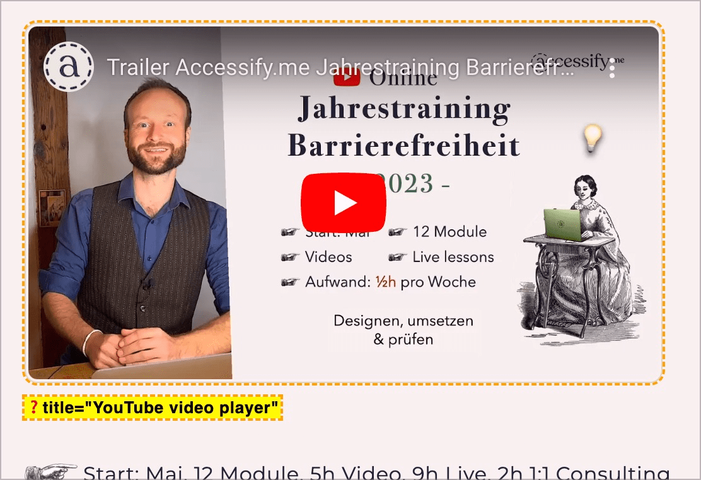

# Prüfpunkt: Titel von Video- und Audio

## Beschreibung

Video- und Audio-Inhalte weisen einen Alternativtext auf, der den Titel und/oder eine kurze Umschreibung vermittelt.

## Prüfmethode (in Kürze)

**Manuelle Prüfung:** Alternativtext mit Inhalt vergleichen: Ist der Titel bzw. die Umschreibung passend?

## Prüfmethode für Web (ausführlich)

### Prüf-Schritte

1. Seite öffnen
1. 🏷️-53 ausführen (oder mit 🏷️-47 untersuchen)
1. Sicherstellen, dass eingebettete Videos und Audios passende Alternativtexte aufweisen
    - **🙂 Beispiel:** Ein per `<iframe>` eingebettetes Video hat den Titel "Rückschau Geschäftsausflug 2023 ACME Inc."
        - **🙂 Beispiel:** "Geschäftsausflug 2023" reicht ebenfalls, aber etwas mehr Info kann sinnvoll sein
        - **🙄 Beispiel:** "YouTube Video Player" reicht knapp aus (falls es nur ein einziges Video auf der Seite hat und aus dem Kontext heraus klar ist, worum es sich beim Video handelt)
            - **😡 Beispiel:** Es reicht aber nicht, wenn mehrere Videos vorhanden sind, oder der Kontext nicht klar ist.
        - **😡 Beispiel:** Das Video hat überhaupt keinen Titel

⚠️ Es gibt weitere Möglichkeiten, Multimedia einzubetten, wie etwa `<embed>`, `<audio>` und `<video>`. Dabei ist sinngemäss vorzugehen.

## Screenshots typischer Fälle

