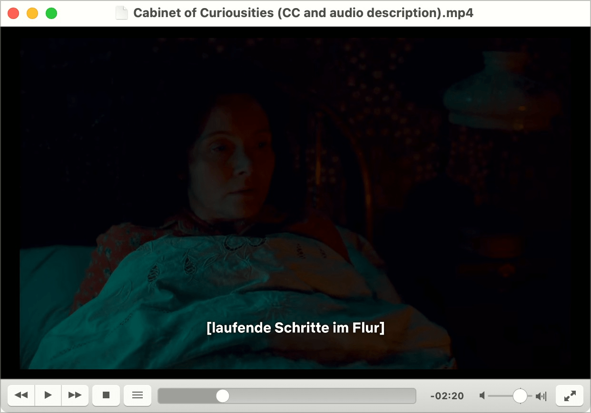

# Prüfpunkt: Untertitel

## Beschreibung

Für aufgezeichnete Video-Inhalte mit Audio (z.B. Spielfilme) existieren gleichwertige, synchrone Untertitel.

## Prüfmethode (in Kürze)

**Manuelle Prüfung:** Untertitel mit Gesprochenem vergleichen: Sind die Inhalte gleichwertig?

## Prüfmethode für Web (ausführlich)

### Prüf-Schritte

1. Seite öffnen
1. Video-Inhalt mit Audio starten
1. Sicherstellen, dass Untertitel verfügbar:
    - **🙂 Beispiel:** Untertitel sind "eingebrannt" in Video (Open Caption)
    - **🙂 Beispiel:** Untertitel sind ein-/ausschaltbar (Closed Caption)
    - **😡 Beispiel:** Keine Untertitel verfügbar
1. Sicherstellen, dass Untertitel den Erwartungen entsprechen:
    - ⚠️ Die Untertitelung muss nicht 1:1 dem Gesprochenen entsprechen, es darf aber keine wichtige Information entfallen.
    - Alle relevanten Infos vorhanden?
    - Bedeutung-tragende Töne ebenfalls?
        - **🙂 Beispiel:** Besetzt-Zeichen bei Telefon-Anruf
        - **🙂 Beispiel:** Hinweis auf entspannte Hintergrund-Musik → insb. wenn ansonsten nichts gesagt wird
        - **😡 Beispiel:** Der Hinweis auf eine Sirene im Hintergrund fehlt, welche das Herannahen der Polizei ankündigt.
    - Synchron mit Gesprochenem?
    - Keine Rechtschreib- oder Übersetzungs-Fehler?
        - ⚠️ Insb. bei automatischer Übersetzung!
        - **😡 Beispiel:** "You have all the fun" wird automatisiert übersetzt zu "You have all the fine"

## Screenshots typischer Fälle

### YouTube

YouTube erstellt Untertitel automatisch. Sie können manuell ein-/ausgeblendet werden (Closed Captions).

### SwissID

Das Video von SwissID benötigt keine spezifische Untertitelung, da alle Texte schon im Video selber angezeigt werden.

### Netflix

Ein Horrorfilm lebt stark von teils sehr subtilen Audio-Effekten, ohne dass man deren Ursprung sieht (etwa "laufende Schritte im Flur", während die Kamera auf eine Person im Bett gerichtet ist).