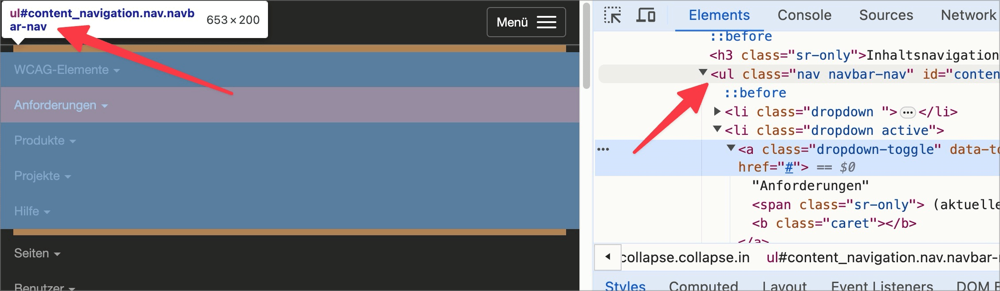

# Prüfpunkt: Aufzählungen semantisch korrekt

## Beschreibung

Aufzählungen sind semantisch korrekt als Listen (`<ul>`, `<ol>`, `<dl>`) formatiert.

## Prüfmethode (in Kürze)

**Bookmarklet "Inhalte gegliedert":** Ausführen und mit Seite abgleichen: Sind Aufzählungen als solche ausgezeichnet?

## Prüfmethode für Web (ausführlich)

### Prüf-Schritte

1. Seite öffnen
1. 🏷️-44 ausführen
1. Sicherstellen, dass Listen semantisch korrekt umgesetzt
    - **🙂 Beispiel:** Eine vertikale Seiten-Navigation ist als `<ul>` oder `<ol>` ausgezeichnet
    - **🙂 Beispiel:** Eine horizontale Aneinander-Reihung von Social-Media-Links ist als `<ul>` oder `<ol>` ausgezeichnet
    - **😡 Beispiel:** Eine Einkaufs-Liste ist nur mittels Plain-Text-Bindestrichen (z.B. `- Brot`) und Umbrüchen (` `) umgesetzt

### Nachprüfen mit Screenreader

Eine Liste muss immer aus einem Container (`<ul>` oder `<ol>`) bestehen und darf als direkte Kind-Elemente nur `<li>` beinhalten! Bei zweifelhaftem Code (z.B. Einsatz von `role="list"`) sollte besser mit 🏷️-13 nachprüft werden:

- `L` drücken, um Listen direkt anzuspringen
- `I` drücken, um Punkte innerhalb einer Liste direkt anzuspringen

⚠️ Denn: viele Fehler findet man oft auch ohne Screenreader, z.B. wenn die Semantik komplett fehlt oder offensichtlich falsch ist. Wenn Semantik aber grundsätzlich **vorhanden scheint**, lässt sich deren Korrektheit und Sinnhaftigkeit oft nur mit Screenreader final beurteilen.

## Screenshots typischer Fälle

