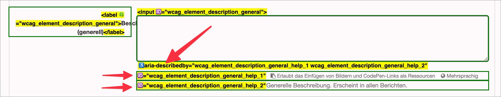

# Prüfpunkt: Text-Elemente zwischen Eingabefeldern

## Beschreibung

Text-Elemente, die sich zwischen den Eingabefeldern befinden (z.B. ein `<h3>` oder `
`), sind verknüpft mit den relevanten Formularfeldern (z.B. mit `aria-describedby`), sodass sie bei Fokus der Felder auch mit Screenreader wahrgenommen werden können.

## Prüfmethode (in Kürze)

**Screenreader:** Durch Eingabefelder navigieren mittels `Tab`-Taste und prüfen, ob relevante Text-Elemente dabei auch ausgegeben werden.

## Prüfmethode für Web (ausführlich)

### Prüf-Schritte

1. Seite mit Formular-Elementen öffnen
1. **🏷️-50 Forms Bookmarklet** ausführen (oder mit **🏷️-47 DOM Inspektor** untersuchen)
1. Sicherstellen, dass Text-Elemente zwischen Formular-Elementen korrekt mit diesen verbunden sind
    - ⚠️ Jedes Eingabefeld benötigt ein `<label>`; dies wird aber nicht hier, sondern unter **✅-37 Formularfelder Labels** geprüft!
    - ⚠️ Meldungen bei fehlerhaften Formular-Eingaben werden auch mit `aria-describedby` umgesetzt; dies wird aber nicht hier, sondern unter **✅-93 Fehlermeldungen in Formularen** geprüft!
    - **🙂 Beispiel:** Unter einem Text-Feld befindet sich ein `
` mit weiteren Anweisungen (z.B. "Wir freuen uns über konstruktive Kritik"). Der Paragraf ist via `aria-describedby` mit dem Text-Feld verbunden.
        - **😡 Beispiel:** Der Paragraf ist **nicht** verbunden.
    - **🙄 Beispiel:** Eine Gruppe von Radiobuttons wird mit einem `
` "Bitte wählen Sie Ihre Lieblingsspeise" eingeleitet; der Paragraf ist via `aria-describedby` mit jedem einzelnen Radiobutton verbunden.
        - ⚠️ Hier wäre eine `<fieldset>`/`<legend>`-Kombination vorzuziehen, siehe **✅-35 Fieldset / Legend**
        - **😡 Beispiel:** der Paragraf ist via `aria-describedby` nur mit einem Radiobutton verbunden
            - ⚠️ Je nachdem, welche Radiobuttons vom Nutzer fokussiert werden, wird der assoziierte Text vom Screenreader ggf. nicht vorgelesen
    - **🙂 Beispiel:** Ein Schalter "Kauf abschliessen" mit einem `
` "Durch Abschicken des Formulars bestätige ich, die AGBs gelesen zu haben" davor oder danach; der Paragraf ist via `aria-describedby` mit dem Schalter verbunden.
        - **😡 Beispiel:** Der Text ist **nicht** verbunden.

### Nachprüfen mit Screenreader

Bei komplexen Formularen oder zweifelhaftem Code (z.B. Einsatz von `aria-label`) sollte besser mit **🏷️-13 NVDA Screenreader** nachgeprüft werden:

- `Tab` (oder auch `F` oder `I`) drücken, um von Eingabefeld zu Eingabefeld zu springen
- Dann sicherstellen, dass der Screenreader alle relevante Information für's Feld vorliest

⚠️ Denn: viele Fehler findet man oft auch ohne Screenreader, z.B. wenn die Semantik komplett fehlt oder offensichtlich falsch ist. Wenn Semantik aber grundsätzlich **vorhanden scheint**, lässt sich deren Korrektheit und Sinnhaftigkeit oft nur mit Screenreader final beurteilen.

### Nur Plain-Text via aria-describedby

Elemente, die via `aria-describedby` (**🏷️-29 aria-describedby**) mit einem Element verknüpft sind, werden nur als Plain-Text ausgegeben. Information über enthaltene Semantik wird ausgegeben (z.B. ein Link "AGBs lesen" in einem Paragraf wird nur als "AGBs lesen" angesagt, nicht als "Link AGBs lesen"). Insofern müssen solche beschreibenden Texte so geschrieben werden, dass sie auch ohne semantische Info verständlich bleiben.

## Screenshots typischer Fälle

