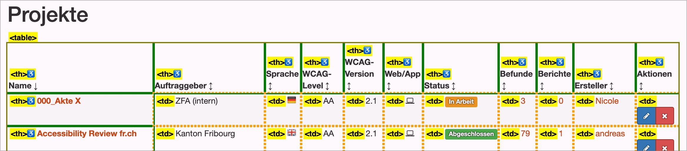

# Prüfpunkt: Tabelle semantisch korrekt

## Beschreibung

Daten, welche eindeutig tabellarischen Charakter aufweisen (also keine Layout-Tabellen), sind semantisch korrekt als Tabelle formatiert und enthalten möglichst keine komplexen semantischen Strukturen, z.B. Überschriften-Elemente (`<h1>` bis `<h6>`).

## Prüfmethode (in Kürze)

**Web Developer Toolbar:** Outline > "Show Element Tag Names" aktivieren > Outline Table Cells: Tabelle erkunden und prüfen, ob sie semantisch korrekt formatiert sind.

## Prüfmethode für Web (ausführlich)

### Prüf-Schritte

1. Seite öffnen
1. 🏷️-49 ausführen
1. Sicherstellen, dass Tabellen-artige Elemente auch tatsächlich als `<table>` umgesetzt sind
    - **🙂 Beispiel:** Eine Tabelle ist korrekt als `<table>` umgesetzt
    - **🙄 Beispiel:** Eine Tabelle ist als `
` umgesetzt
        - ⚠️ Mit dem korrekten Einsatz von ARIA (`role="table"` oder `role="grid"`) kann auch ein `
`-Konstrukt barrierefrei gemacht werden! Dies ist aber relativ kompliziert und wird ggf. nicht von allen Browsern und Screenreadern unterstützt. Wir empfehlen unseren Kunden, wenn möglich stets klassisches HTML zu verwenden!
    - **😡 Beispiel:** Eine Tabelle ist als `
`-Konstrukt umgesetzt (ohne ARIA).

### Nachprüfen mit Screenreader

Bei zweifelhaftem Code (z.B. Einsatz von `role="table"` oder `role="grid"`) sollte besser mit 🏷️-13 nachgeprüft werden:

- Mit `T` zu Tabelle springen
- Mit `Ctrl`+`Alt`+`Pfeile` durch die Zellen navigieren (quasi wie in Excel) und sicherstellen, dass jeweils die korrekten Zeilen-Header angesagt werden

⚠️ Denn: viele Fehler findet man oft auch ohne Screenreader, z.B. wenn die Semantik komplett fehlt oder offensichtlich falsch ist. Wenn Semantik aber grundsätzlich **vorhanden scheint**, lässt sich deren Korrektheit und Sinnhaftigkeit oft nur mit Screenreader final beurteilen.

## Screenshots typischer Fälle

