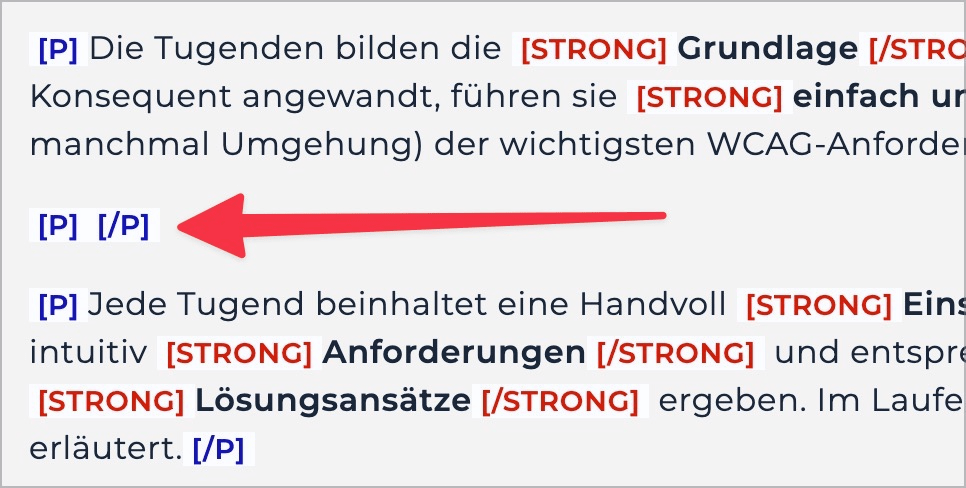

# Prüfpunkt: Leere Elemente

## Beschreibung

Leere bedeutungstragende Elemente werden vermieden.

## Prüfmethode (in Kürze)

**Bookmarklet "Inhalte gegliedert":** Ausführen und mit Seite abgleichen: Befinden sich irgendwo leere bedeutungstragende Elemente?

## Prüfmethode für Web (ausführlich)

### Prüf-Schritte

1. Seite öffnen
1. 🏷️-44 ausführen (oder mit 🏷️-13 direkt mit `P` von Paragraf zu Paragraf springen)
    - ⚠️ Um Probleme genauer zu evaluieren, ist der 🏷️-47 nützlich
1. Sicherstellen, dass keine leeren `
` vorhanden sind
    - **🙂 Beispiel:** Es sind keine leeren `
` vorhanden
    - **😡 Beispiel:** Es sind leere `
` vorhanden (z.B. um Abstand zwischen zwei Textblöcken zu generieren, oder einfach weil sie "vergessen" wurden)

⚠️ Es geht hier spezifisch um Paragrafen! Screenreader kündigen andere Elemente manchmal auch als "leer" an.

## Screenshots typischer Fälle

