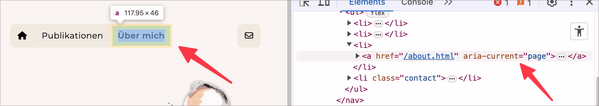

# Prüfpunkt: Aktive Elemente

## Beschreibung

Aktive Elemente (z.B. der aktive Menüpunkt in einer Navigation) sind semantisch erkennbar ausgezeichnet, wenn sie visuell klar als aktiv erkennbar sind.

## Prüfmethode (in Kürze)

**Screenreader:** Erkunden und Ausgaben prüfen: Werden aktive Punkte als solche erkennbar ausgegeben?

## Prüfmethode für Web (ausführlich)

### Prüf-Schritte

1. Seite öffnen
1. Mit **🏷️-13 NVDA Screenreader** Navigationen und ähnliche Elemente lesen und bedienen (oder mit **🏷️-47 DOM Inspektor** direkt untersuchen)
1. Sicherstellen, dass aktive Navigations-Punkte als solche angesagt werden
    - **🙂 Beispiel:** Eine Seite hat eine Navigation im Kopfbereich; das aktuell gewählte Navigations-Element wird als "aktuelle Seite", "aktiv", "gewählt" o.ä. angesagt
        - ⚠️ Es geht hier **nicht** darum, dass beim aktiven Wählen eines Eintrags der Screenreader ein Feedback gibt!
        - **😡 Beispiel:** Das Navigations-Element ist zwar visuell klar als gewählt erkennbar, aber der Screenreader gibt keinen entsprechenden Hinweis.
    - **🙂 Beispiel:** Bei einer Prozess-Navigation wird der aktive Schritt als "aktiv" o.ä. angesagt
        - ⚠️ Es geht hier **nicht** darum, dass das Element insgesamt als Prozess-Navigation erkennbar ist mit Screenreader (dafür existiert **✅-23 Breadcrumbs und Prozessanzeigen**)!
        - **😡 Beispiel:** Der Screenreader gibt keinen entsprechenden Hinweis.

## Screenshots typischer Fälle

