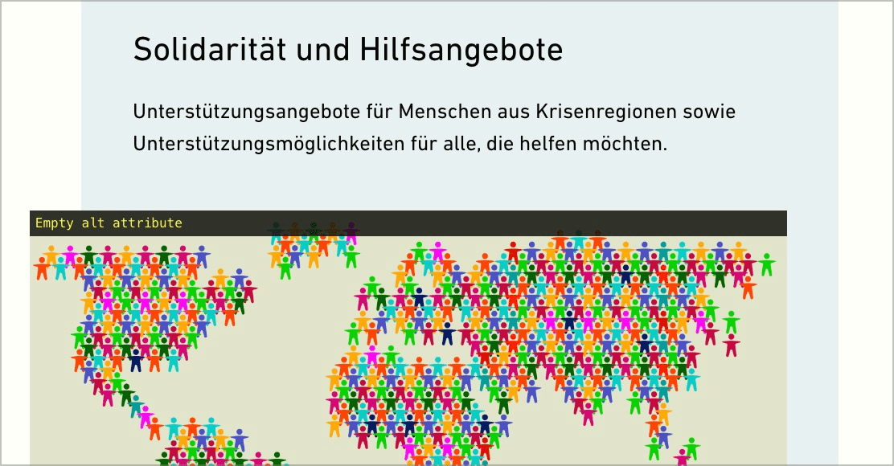

# ✅ Dekorative Grafiken

## Beschreibung

Dekorative Grafiken, welche als `` umgesetzt sind, weisen ein leeres `alt`-Attribut auf, damit sie von assistierenden Geräten ignoriert werden können.

## Prüfmethode (in Kürze)

**Web Developer Toolbar:** Images > Display Alt Attributes: Angezeigte Alternativtexte mit Bildern abgleichen.

## Prüfmethode für Web (ausführlich)

### Prüf-Schritte

1. Seite öffnen
1. **🏷️-32 Image Alt Text Viewer Extension** ausführen (oder in **🏷️-51 Web Developer Extension** unter "Images" → "Display Alt Attributes" wählen)
1. Sicherstellen, dass dekorative Grafiken vom Screenreader ignoriert werden
    - ⚠️ Wenn ein solches Bild mittels `` umgesetzt ist, muss dessen `alt`-Attribut leer sein. Bei einem als CSS `background-image: url(...)` umgesetzten dekorativen Bild muss nichts weiter getan werden (da es dadurch sowieso als dekorativ eingestuft wird).
    - **🙂 Beispiel:** Ein kleines, dekoratives Ornament wird als visueller Aufteiler (Spacer) zwischen zwei Paragrafen eingesetzt
    - **🙂 Beispiel:** Ein Reisebüro möchte auf seine Reiseangebote für Meeres-Destinationen aufmerksam machen und zeigt ein dekoratives Foto eines Strands mit Palmen am Meer

⚠️ Es ist oft gar nicht so leicht zu entscheiden, ob ein Bild tatsächlich dekorativ ist. Auch wenn man mit einem Bild z.B. nur eine Emotion hervor rufen möchte (etwa obiges Strandfoto), dann möchten Screenreader-Nutzende vielleicht auch eine solche Emotion erfahren? Insofern wäre es ggf. falsch, das Bild als rein dekorativ einzustufen; stattdessen wäre ein Alternativtext wie "Sehnen Sie sich auch nach einem Sandstrand mit Palmen am Meer?" u.U. besser. Hier gehen die Meinungen aber stark auseinander: gewisse Leute wollen möglichst keine unnötigen Details, andere wiederum möchten möglichst nichts verpassen! Schlussendlich kann der Seitenbetreiber entscheiden, was sinnvoll ist, Hauptsache er hat sich die notwendigen Gedanken gemacht.

## Screenshots typischer Fälle

