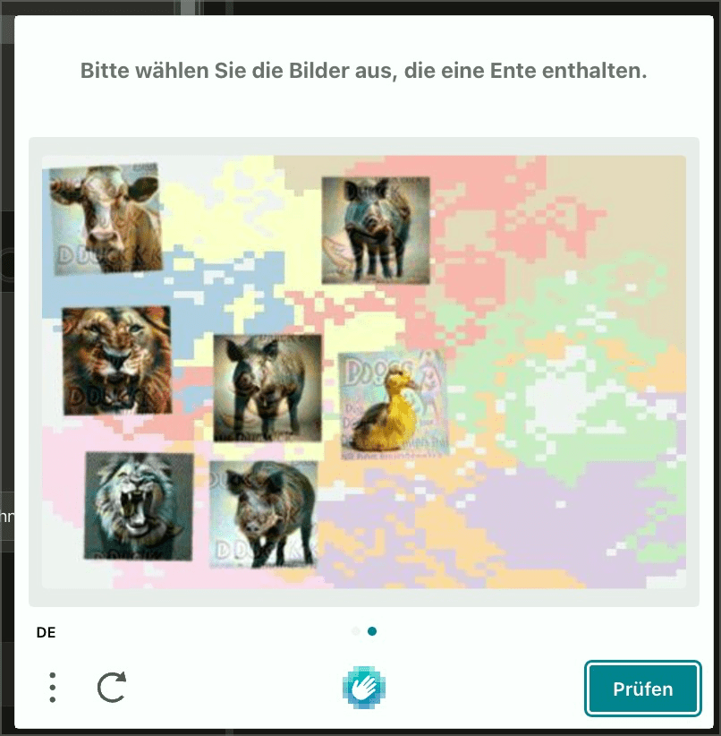

# ✅ Grafische CAPTCHAs

WCAG-Kriterium: [📜 1.1.1 Nicht-Text-Inhalt - A](..)

## Beschreibung

Grafische CAPTCHAs bieten eine Alternative (z.B. Audio-CAPTCHA).

## Prüfmethode (in Kürze)

**Screenreader:** Versuchen, das Captcha erfolgreich abzuschicken.

## Prüfmethode für Web (ausführlich)

### Test-Schritte

Grafische CAPTCHAs sind per se nicht barrierefrei: ihr Sinn und Zweck ist ja, dass die gestellte Aufgabe nicht programmatisch gelöst werden kann (also z.B. durch einen Bot), sondern dass nur ein Mensch sie lösen kann. Insofern geht es bei diesem Prüfpunkt nur darum, sicherzustellen, dass ein CAPTCHA nicht nur über eine einzige Modalität (z.B. visuell) gelöst werden kann, sondern über weitere (z.B. Audio).

Vergleiche auch [📜-3.3.8 Barrierefreie Authentifizierung (Minimum)](/de/wcag/3.3.8-barrierefreie-authentifizierung-minimum).

## Prüfmethode für Mobile (Ergänzungen zu Web)

Auf Mobile Webseiten und Web-Views innerhalb einer App 1:1 übertragbar.

Native Mobile Apps hingegen werden auf persönliche Geräte installiert, weshalb eine zusätzliche Überprüfung, ob ein Nutzer menschlich ist, im Normalfall entfällt.

## Prüfmethode für PDF (Ergänzungen zu Web)

Für PDF nicht anwendbar.

## Details zum blinden Testen

Es kann getestet werden, ob ein vorliegendes visuelles CAPTCHA z.B. auch auditiv gelöst werden kann.

## Screenshots typischer Fälle

## Videos

Keine Videos verfügbar.
