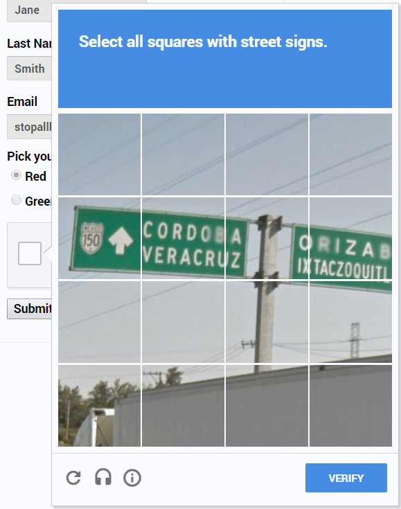
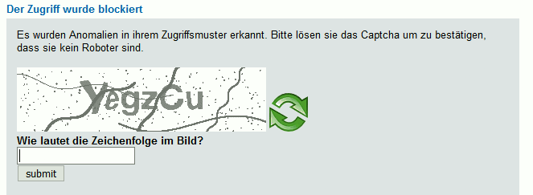

# Prüfpunkt: Grafische CAPTCHAs

## Beschreibung

Grafische CAPTCHAs bieten eine Alternative (z.B. Audio-CAPTCHA).

## Prüfmethode (in Kürze)

**Screenreader:** Versuchen, das Captcha erfolgreich abzuschicken.

## Prüfmethode für Web (ausführlich)

### Test-Schritte

Grafische CAPTCHAs sind per se nicht barrierefrei: ihr Sinn und Zweck ist ja, dass die gestellte Aufgabe nicht programmatisch gelöst werden kann (also z.B. durch einen Bot), sondern dass nur ein Mensch sie lösen kann. Insofern geht es bei diesem Prüfpunkt nur darum, sicherzustellen, dass ein CAPTCHA nicht nur über eine einzige Modalität (z.B. visuell) gelöst werden kann, sondern über weitere (z.B. Audio).

Vergleiche auch **📜-3.3.8 Barrierefreie Authentifizierung (Minimum)**.

## Screenshots typischer Fälle

