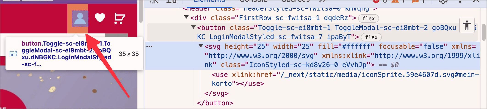

# ✅ Grafische Schalter

WCAG-Kriterium: [📜 1.1.1 Nicht-Text-Inhalt - A](..)

## Beschreibung

Grafische Schalter sind korrekt beschriftet.

## Prüfmethode (in Kürze)

**Web Developer Toolbar:** Images > Display Alt Attributes: Angezeigte Alternativtexte mit Bildern abgleichen.

## Prüfmethode für Web (ausführlich)

### Prüf-Schritte

1. Seite öffnen
1. Mit [🏷️ NVDA Screenreader](/de/tags/werkzeuge/screenreader/desktop-screenreader/nvda-screenreader) die Schalter vorlesen lassen (oder in [🏷️ Web Developer Extension](/de/tags/werkzeuge/extensions/web-developer-extension) unter "Images" → "Display Alt Attributes" wählen)
    - ⚠️ Eine Übersicht von Schaltern kann mittels `Insert`+`F7` und dann `Alt`+`S` angezeigt werden
1. Sicherstellen, dass grafische Schalter einen passenden Alternativtext aufweisen
    - **🙂 Beispiel:** Ein Schalter mit einem Warenkorb-Symbol hat die Beschriftung "Warenkorb", "Zum Warenkorb", "Warenkorb anzeigen", o.ä.
        - ⚠️ Es ist nicht relevant, welche Technik für die Beschriftung verwendet wird: es muss also nicht unbedingt ein `alt`-Attribut o.ä. sein, sondern es kann auch visuell versteckter Text, `aria-label` o.ä. eingesetzt werden.
        - **🙄 Beispiel:** Die Beschriftung ist "Einkaufswagen" → beschreibt das Symbol und nicht unbedingt den Zweck
        - **😡 Beispiel:** Es hat gar keine Beschriftung
    - **🙂 Beispiel:** Ein Formular hat einen Pfeil-nach-rechts-Schalter zum Abschicken, die Beschriftung ist "Abschicken", "Absenden", "Formular schicken", o.ä.
        - **🙄 Beispiel:** Die Beschriftung ist "Pfeil nach rechts" → beschreibt das Symbol und nicht unbedingt den Zweck
        - **🙄 Beispiel:** Die Beschriftung ist "Los!" → auch nicht sehr aussagekräftig
        - **😡 Beispiel:** Es hat gar keine Beschriftung

## Screenshots typischer Fälle

