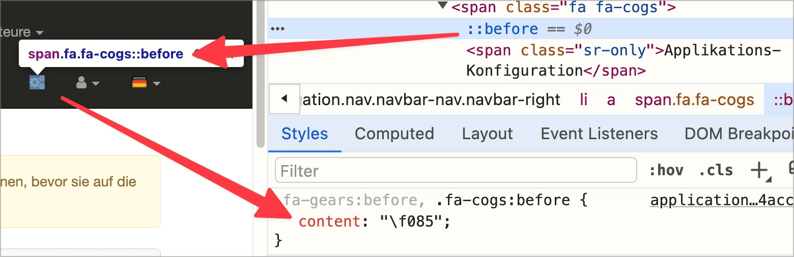

# ✅ Grafische Symbole

WCAG-Kriterium: [📜 1.1.1 Nicht-Text-Inhalt - A](..)

## Beschreibung

Grafische Symbole (z.B. Webfonts oder Emojis) sind so umgesetzt, dass sie nicht zu unverständlichen Ausgaben durch Screenreader führen.

## Prüfmethode (in Kürze)

**Screenreader:** Symbole vorlesen lassen und sicher stellen, dass keine unerwarteten/unpassenden Ausgaben passieren.

## Prüfmethode für Web (ausführlich)

### Prüf-Schritte

1. Seite öffnen
1. Mit [🏷️ NVDA Screenreader](/de/tags/nvda-screenreader) die Inhalte lesen
1. Sicherstellen, dass symbolhafte Schriftzeichen sinnvoll ausgegeben werden
    - **🙂 Beispiel:** Ein per Webfont eingebundenes "User" Symbol wird als "Benutzer" o.ä. angesagt
        - **😡 Beispiel:** Es wird unverständlich ausgegeben, etwa ???
        - **😡 Beispiel:** Es wird gar nichts ausgegeben
    - **🙄 Beispiel:** In einer Meteo-Prognose wird die Windrichtung durch unterschiedliche Pfeile angesagt, z.B. "Pfeil nach rechts" oder "Pfeil nach rechts oben"
        - ⚠️ Tendenziell sollte hier aber ein spezifischer Alternativtext gesetzt werden, z.B. "Windstärke bleibt gleich" bzw. "Windstärke nimmt zu"
    - **😡 Beispiel:** In einem Webshop wird das Emoji "🚨" eingesetzt, um anzuzeigen, dass ein Element nicht verfügbar ist; dieses wird allerdings nicht einheitlich von Screenreadern ausgegeben (VoiceOver sagt z.B. "Rotes Blinklicht", NVDA hingegen "Polizeilicht").
        - ⚠️ Viele Emojis sind nicht eindeutig in ihrer Bedeutung, auch über kulturelle Grenzen hinweg! Im Zweifelsfall besser einen Alternativtext via z.B. `aria-label` setzen.

## Screenshots typischer Fälle

