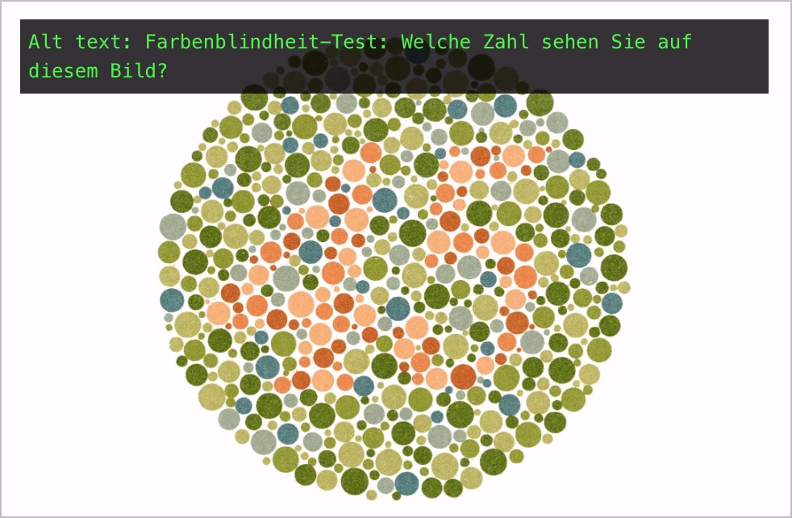

# ✅ Grafische Tests und Übungen

WCAG-Kriterium: [📜 1.1.1 Nicht-Text-Inhalt - A](..)

## Beschreibung

Tests und Übungen, deren Inhalt zwingend aus Nicht-Text-Inhalt bestehen muss, weisen einen Alternativtext auf, der dessen Zweck beschreibt (ohne die Information, die benötigt wird, um den Test oder die Übung zu bestehen).

## Prüfmethode (in Kürze)

**Web Developer Toolbar:** Images > Display Alt Attributes: Angezeigte Alternativtext mit Inhalt vergleichen: Beschreibt dieser den Zweck des Inhalts passend?

## Prüfmethode für Web (ausführlich)

### Prüf-Schritte

1. Seite öffnen
1. [🏷️ Image Alt Text Viewer Extension](/de/tags/image-alt-text-viewer-extension) ausführen (oder in [🏷️ Web Developer Extension](/de/tags/web-developer-extension) unter "Images" → "Display Alt Attributes" wählen)
1. Sicherstellen, dass solche Grafiken einen passenden Alternativtext aufweisen
    - **🙂 Beispiel:** Bei einem Farbenblindheit-Test hat eine Farbtafel den Alternativtext "Ishihara Farbenblindheit-Test: Welche Zahl sehen Sie auf diesem Bild?"
        - ⚠️ Ausserhalb eines Test-Settings macht es natürlich Sinn, die Farbtafel genauer zu beschreiben, z.B. "Farbenblindheit-Test: Ishihara-Farbtafel 45"

## Prüfmethode für Mobile (Ergänzungen zu Web)

Sowohl auf Web-Views als auch native Inhalte 1:1 übertragbar.

## Prüfmethode für PDF (Ergänzungen zu Web)

Prüf-Schritte analog zu Web.

## Details zum blinden Testen

Sehr eingeschränkt: es kann zwar evaluiert werden, ob eine Grafik einen Alternativtext hat oder nicht - ob dieser aber sinnvoll ist, ist gerade hier kaum zu beurteilen.

## Screenshots typischer Fälle

## Videos

Keine Videos verfügbar.
