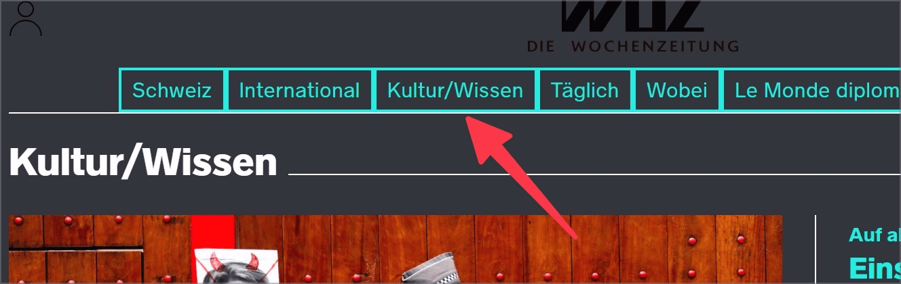
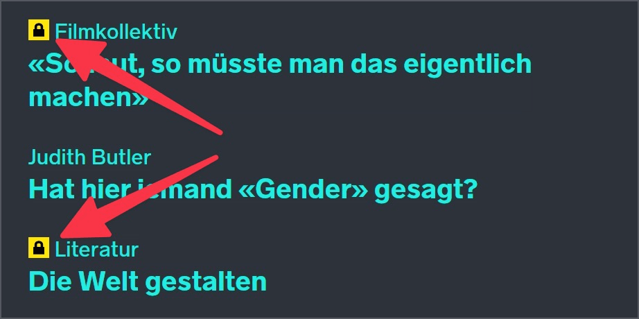
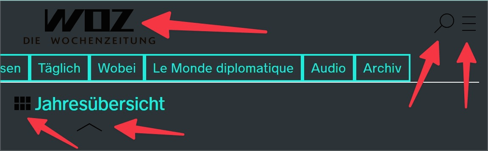

# ✅ Hochkontrast-Modus

WCAG-Kriterium: [📜 1.1.1 Nicht-Text-Inhalt - A](..)

## Beschreibung

Informative Grafiken und grafische Elemente (z.B. Häkchen in einer aktivierten Checkbox, Hervorhebung des aktiven Elements in einer Navigation, oder die Umrandung eines Textfelds) sind im Forced-Colors-Modus sichtbar.

## Prüfmethode (in Kürze)

**Windows High Contrast Mode** aktivieren (bis Windows 10: `Alt` + `Shift` + `PrtScn`; ab Windows 11: `System Einstellungen` → `Barrierefreiheit` → `Kontrast-Designs` → `Nachthimmel` o.ä. wählen): Sind alle informativen Grafiken nach wie vor sichtbar?

## Prüfmethode für Web (ausführlich)

### Prüf-Schritte

1. Seite öffnen
1. [🏷️ Hochkontrast-Modus (Forced-Colors)](/de/tags/hochkontrast-modus-forced-colors) aktivieren
1. Sicherstellen, dass informative Grafiken und grafische Elemente weiterhin sichtbar sind
    - **🙂 Beispiel:** Ein Mitarbeiter-Foto ist im Hochkontrast-Modus weiterhin sichtbar
        - **😡 Beispiel:** Das Foto ist nicht mehr sichtbar (weil es z.B. mit CSS `background-image` umgesetzt wurde)
    - **🙂 Beispiel:** Ein Link mit Warenkorb-Symbol (ohne sonstige sichtbare Text-Beschriftung) ist im Hochkontrast-Modus weiterhin sichtbar
        - **😡 Beispiel:** Das Warenkorb-Symbol ist nicht mehr sichtbar → und damit auch der gesamte Link
        - **🙄 Beispiel:** Das Warenkorb-Symbol ist nicht mehr sichtbar, aber es hat daneben noch eine sichtbare Text-Beschriftung ("Warenkorb" o.ä.") → damit ist das Symbol redundant und muss nicht unbedingt gesehen werden können
    - **🙂 Beispiel:** Ein Firmenlogo mit transparentem Hintergrund ist im Hochkontrast-Modus weiterhin gut sichtbar
        - **😡 Beispiel:** Der Schriftzug des Firmenlogos hat eine ähnliche (oder dieselbe) Farbe wie die neue Hintergrundfarbe (z.B. beide Dunkelgrau oder Schwarz), deshalb ist der Schriftzug weniger gut (oder gar nicht mehr) wahrnehmbar
            - ⚠️ Dies ist abhängig davon, welche Standard-Farben der Forced-Colors-Modus aktiviert - und ein Hinweis darauf, dass keine fixe Hintergrundfarbe für den Hoch-Kontrast-Modus definiert wurde (z.B. mittels `@media (forced-colors: active)`
    - **🙂 Beispiel:** Ein Formular bietet Checkboxen in eigenem (custom) Design an; auch bei Hochkontrast sind die Checkboxen und ihr Zustand (gewählt / nicht gewählt) gut erkennbar
        - **😡 Beispiel:** Die Checkboxen sind nicht mehr erkennbar, und/oder ihr Zustand ist nicht mehr erkennbar
    - **🙂 Beispiel:** Eine Tabliste ([✅ Tabs / Tablisten](/de/wcag/4.1.2a-erweiterte-steuerelemente-widgets/tabs-tablisten)) zeigt alle Tabs mit schwarzem Schriftzug und weissem Hintergrund an, wobei das ausgewählte Tab diese Farben invertiert; im Hochkontrast-Modus wird ein anderes grafisches Merkmal verwendet, um das aktive Tab zu kennzeichnen (z.B. Unterstreichung, Fettsetzung, ein Listen-Bullet, o.ä.)
        - **😡 Beispiel:** Im Hochkontrast-Modus ist nicht mehr erkennbar, welches Tab aktiv ist (weil alle Farben auf den System-Standard gesetzt werden und Invertieren der Farben keinen Effekt mehr hat)
    - **🙂 Beispiel:** Ein Textfeld hat keine Umrandung (CSS `border`), sondern wird nur durch die Hintergrundfarbe erkennbar; im Hochkontrast-Modus wird zusätzlich eine Umrandung angezeigt
        - **😡 Beispiel:** Im Hochkontrast-Modus wird keine zusätzliche Umrandung angezeigt, deshalb ist das Textfeld nicht mehr erkennbar

## Screenshots typischer Fälle

