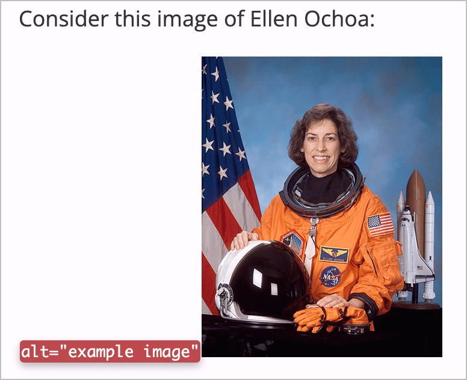

# ✅ Informative Grafiken

WCAG-Kriterium: [📜 1.1.1 Nicht-Text-Inhalt - A](..)

## Beschreibung

Informative Grafiken weisen einen Alternativtext auf, der äquivalente Informationen vermittelt.

## Prüfmethode (in Kürze)

**Web Developer Toolbar:** Images > Display Alt Attributes: Angezeigte Alternativtexte mit Bildern abgleichen. Oder: Code-Analyse.

## Prüfmethode für Web (ausführlich)

### Prüf-Schritte

1. Seite öffnen
1. [🏷️ Image Alt Text Viewer Extension](/de/tags/image-alt-text-viewer-extension) ausführen (oder in [🏷️ Web Developer Extension](/de/tags/web-developer-extension) unter "Images" → "Display Alt Attributes" wählen)
1. Sicherstellen, dass informative Grafiken einen passenden Alternativtext aufweisen
    - **🙂 Beispiel:** Ein Mitarbeiter-Foto hat den Alternativtext "Profilfoto von Hans Muster"
        - **🙂 Beispiel:** "Hans Muster" reicht ebenfalls, aber etwas mehr Info kann sinnvoll sein
        - **🙄 Beispiel:** "Profilfoto", "Foto des Mitarbeiters" reicht, wenn die Seite nur einen einzelnen Mitarbeiter zeigt (Foto eindeutig zuordenbar)
            - **😡 Beispiel:** Wenn es sich um eine Auflistung mehrerer Mitarbeiter handelt, reicht das nicht (Fotos nicht eindeutig zuordenbar)
        - **😡 Beispiel:** Es hat gar keinen Alternativtext
    - **🙂 Beispiel:** Ein Firmenlogo hat den Alternativtext "ACME Inc." oder "Logo von ACME Inc."
        - **😡 Beispiel:** "Logo"
        - **😡 Beispiel:** Das Logo ist nicht als Bild (``, `<svg role="img">` o.ä.) umgesetzt, sondern nur per CSS (z.B. `background-image`)
    - **🙂 Beispiel:** Ein allein stehendes Warenkorb-Symbol hat den Alternativtext "Warenkorb"
        - **🙄 Beispiel:** Das Warenkorb-Symbol steht neben einem zusätzlichen Text "Warenkorb" o.ä. → damit wird das Symbol redundant und sollte besser als dekorativ markiert werden (siehe [✅ Dekorative Grafiken](/de/wcag/1.1.1-nicht-text-inhalt/dekorative-grafiken))
    - **🙂 Beispiel:** In einer Foto-Gallerie werden Fotos eines Team-Ausflugs gezeigt; jedes Foto hat einen Alternativ-Text, z.B. "Hans und Maria sitzen beim Feuer und plaudern fröhlich miteinander"
        - **🙄 Beispiel:** "Mitarbeitende reden" reicht, aber etwas mehr Kontext wäre nett
        - **🙄 Beispiel:** "Geschäftsausflug 2023, Foto Nr. 123" ist wirklich extrem minimalistisch
        - **😡 Beispiel:** "DSC_123.jpg" ist definitiv zu minimalistisch

## Prüfmethode für Mobile (Ergänzungen zu Web)

Sowohl auf Web-Views als auch native Inhalte 1:1 übertragbar.

## Prüfmethode für PDF (Ergänzungen zu Web)

### Prüf-Schritte
1. PDF mit [🏷️ Adobe Reader](/de/tags/adobe-reader) öffnen
1. Mit [🏷️ NVDA Screenreader](/de/tags/nvda-screenreader) vorlesen lassen und/oder
1. Mit [🏷️ PDF Accessibility Checker (PAC)](/de/tags/pdf-accessibility-checker-pac) testen und Screenreader-Vorschau öffnen
1. Prüfen, dass informative Bild über einen sinnvollen Alternativtext verfügen und dass dekorative Elemente/Bilder nicht vom Screenreader ausgegeben werden.

## Details zum blinden Testen

Teilweise: es kann zwar evaluiert werden, ob eine Grafik einen Alternativtext hat oder nicht - ob dieser aber sinnvoll ist, ist oft schwierig zu beurteilen. Auch sind Grafiken manchmal so implementiert, dass sie durch Screenreader gar nicht ausgegeben werden.

[🏷️ VoiceOver/iOS](/de/tags/voiceoverios) versucht zudem, Elemente bzw. Text auf einem Bild per KI zu identifizieren und vorzulesen, wenn kein Alternativtext vorhanden ist. Solche Ausgaben sehen so aus: "Möglicherweise: X, Y, Z".

## Screenshots typischer Fälle

## Videos

- [🎬 Diagramm ohne Alt-Attribut - EWB Portal](/de/videos/diagramm-ohne-alt-attribut-ewb-portal)
