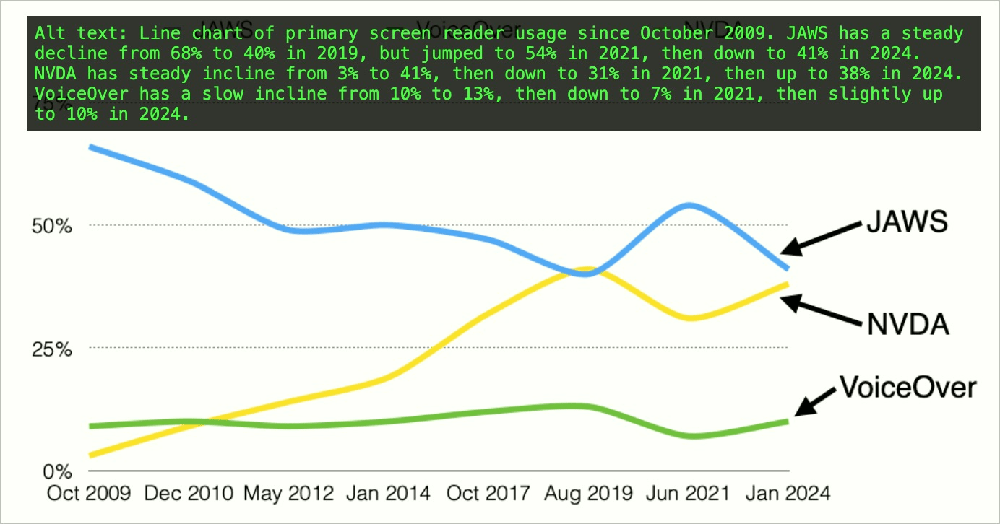
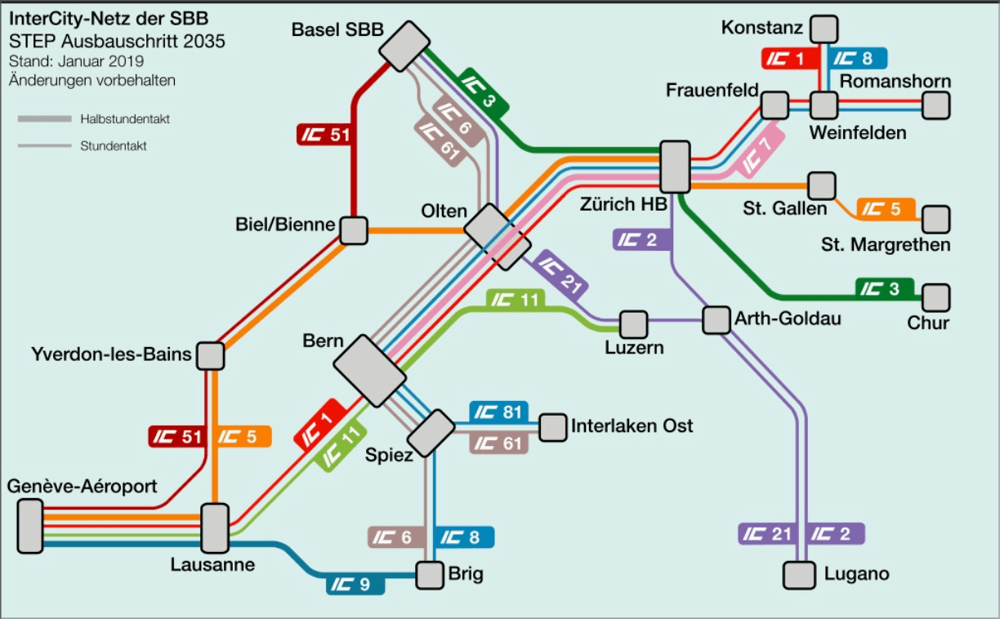

# ✅ Komplexe Grafiken

WCAG-Kriterium: [📜 1.1.1 Nicht-Text-Inhalt - A](..)

## Beschreibung

Wenn Alternativtext nicht ausreicht (z.B. bei komplexen Grafiken wie Infografiken oder Diagrammen), wird eine lange Beschreibung bereitgestellt und im Alternativtext darauf hingewiesen.

## Prüfmethode (in Kürze)

**Web Developer Toolbar:** Images > Display Alt Attributes: Angezeigte Alternativtexte sowie lange Beschreibungen mit Bildern abgleichen.

## Prüfmethode für Web (ausführlich)

### Prüf-Schritte

1. Seite öffnen
1. [🏷️ Image Alt Text Viewer Extension](/de/tags/werkzeuge/extensions/image-alt-text-viewer-extension) ausführen (oder in [🏷️ Web Developer Extension](/de/tags/werkzeuge/extensions/web-developer-extension) unter "Images" → "Display Alt Attributes" wählen)
1. Sicherstellen, dass komplexe Grafiken passende Alternativtexte aufweisen, ggf. mit Verweis auf weitere Information
    - ⚠️ Ein ungeschriebenes (?) Gesetz sagt, dass ein typischer `alt`-Text nicht viel länger als 100 Zeichen sein sollte, u.a. da ausführliche schriftliche Information (z.B. eine kurze Zusammenfassung einer Statistik) ja auch für Sehende interessant sein könnte
    - **🙂 Beispiel:** Ein statistisches Diagramm hat den Alternativtext "Screenreader-Nutzung von 2009 bis 2024, Details siehe unten", darunter befinden sich Text-Paragrafen mit weiteren Infos
        - **🙄 Beispiel:** Statt Text-Paragrafen wird ein Link zum Download der Rohdaten als Excel-Datei angeboten → je nach Kontext kann dies sinnvoll sein, aber es sollte nicht als "billige Entschuldigung" genutzt werden, um sich das Schreiben einer schriftlichen Zusammenfassung zu ersparen!
        - **😡 Beispiel:** "Screenreader-Nutzung von 2009 bis 2024" (und keine weiteren Details darunter) → deutlich zu wenig Information
    - **🙂 Beispiel:** Ein Foto hat einen Alternativtext "Bauer Adam Hasan ist im November aus Khartum geflüchtet", darunter hat es eine `<figcaption>` mit weiteren Informationen, z.B. "Es ist Monate her, seit letztmals Hilfe von aussen kam"
        - ⚠️ In diesem Fall kann es sinnvoll sein, die `<figcaption>` mittels `aria-hidden="true"` komplett zu verstecken vor Screenreadern.
        - **🙄 Beispiel:** Die `<figcaption>` wiederholt die Informationen komplett oder weitgehend, also z.B. "Bauer Adam Hasan ist im November aus Khartum geflüchtet. Es ist Monate her, seit letztmals Hilfe von aussen kam."
        - **🙂 Beispiel:** Der Alternativtext ist "Adam Hasan", die `<figcaption>` ist "Bauer Adam Hasan ist im November aus Khartum geflüchtet. Es ist Monate her, seit letztmals Hilfe von aussen kam."

⚠️ Es gibt komplexe Grafiken, deren sinnvolle Beschreibung schwierig ist, z.B. ein Linienplan der SBB oder eine Meteo-Übersicht. In solchen Fällen muss abgewogen werden, was die wichtigste Information ist. Ggf. ist auf weitere Möglichkeiten hinzuweisen, wie die Informationen ebenfalls beschafft werden können: z.B. die SBB Mobile App, wo man spezifisch Infos über einzelne Linien in Erfahrung bringen kann; oder die Detailansicht der Wettervorhersage, wo die Infos zusätzlich in Tabellenform o.ä. vorhanden sind.

## Screenshots typischer Fälle

