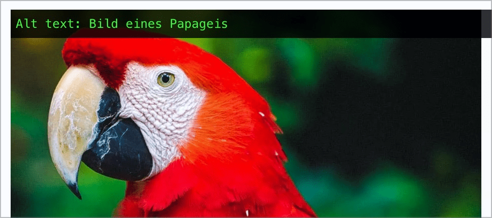

# ✅ Redundanz in Alternativtexten

WCAG-Kriterium: [📜 1.1.1 Nicht-Text-Inhalt - A](..)

## Beschreibung

Alternativtexte von Grafiken beinhalten keine redundanten Informationen, z.B. eine bereits in einer Bildlegende oder einem Linktext vorhandene Information oder eine Information wie `"Grafik …"`, `"Bild …"`.

## Prüfmethode (in Kürze)

**Web Developer Toolbar:** Images > Display Alt Attributes: Angezeigte Alternativtexte mit Bildern abgleichen.

## Prüfmethode für Web (ausführlich)

### Prüf-Schritte

1. Seite öffnen
1. [🏷️ Image Alt Text Viewer Extension](/de/tags/image-alt-text-viewer-extension) ausführen (oder in [🏷️ Web Developer Extension](/de/tags/web-developer-extension) unter "Images" → "Display Alt Attributes" wählen)
1. Sicherstellen, dass Alternativtexte keine Redundanz aufweisen
    - **🙂 Beispiel:** Ein Mitarbeiter-Foto hat den Alternativtext "Foto von Hans Muster"
        - **🙂 Beispiel:** "Hans Muster" reicht ebenfalls, aber etwas mehr Info kann sinnvoll sein
        - **😡 Beispiel:** "Bild von Hans Muster" (der Screenreader sagt von sich aus bereits "Bild", deshalb wäre das "doppelt gemoppelt")
    - **🙂 Beispiel:** Das Foto eines Ölgemäldes hat den Alternativtext "Ölgemälde Seerosen von Claude Monet"
        - **🙂 Beispiel:** "Seerosen von Claude Monet" reicht ebenfalls, aber etwas mehr Info kann sinnvoll sein
        - **🙄 Beispiel:** "Seerosen" → sehr knappe Info (in einer Auflistung mehrerer Bilder von Monet kann das aber durchaus reichen)
        - **🙄 Beispiel:** "Seerosen-Bild von Claude Monet" (auch etwas "doppelt gemoppelt", aber es könnte auch das Augenmerk darauf legen, dass es sich um ein Bild bzw. Gemälde handelt)
    - **🙂 Beispiel:** Ein Clipart zeigt ein grafisch aufwändiges Fragezeichen, der Alternativtext ist "Grafisches Fragezeichen"
        - **🙄 Beispiel:** "Grafik eines Fragezeichens"
            - ⚠️ Screenreader sagen Bilder unterschiedlich an (einige "Bild", andere "Grafik"...), weshalb "Grafik" hier nicht unbedingt "doppelt gemoppelt" sein muss, sondern man das Augenmerk darauf legen wollte, dass es sich um eine künstliche Grafik handelt (und z.B. kein Foto o.ä.)
    - **🙂 Beispiel:** Ein Zeitungs-Artikel hat ein Foto mit dem Alternativtext "Abdul Hassim bei der Arbeit auf dem Feld"; darunter befinden sich Paragrafen mit weiteren Beschreibungen des Bilds, z.B. "Abdul Hassim ist Bauer in 4. Generation. Die Kartoffeln erntet er von Hand, unterstützt nur von seinem Esel."
        - **🙂 Beispiel:** "Abdul Hassim (Details siehe unten)" → ein Hinweis auf umgebenden beschreibenden Text kann ebenfalls sinnvoll sein
        - **🙄 Beispiel:** "Abdul Hassim" → ist etwas gar knapp
        - **🙄 Beispiel:** "Abdul Hassim ist Bauer in 4. Generation und arbeitet auf dem Feld mit seinem Esel" → da ist einiges an Redundanz mit dem umgebenden Text, was manchmal sinnvoll/notwendig sein kann, aber nicht übertrieben werden sollte.
        - **😡 Beispiel:** "Abdul Hassim bei der Arbeit auf dem Feld. Er ist Bauer in 4. Generation. Die Kartoffeln erntet er von Hand, unterstützt nur von seinem Esel." → das ist quasi eine 1:1 Kopie des umgebenden Texts und deshalb übertrieben redundant!

## Screenshots typischer Fälle

