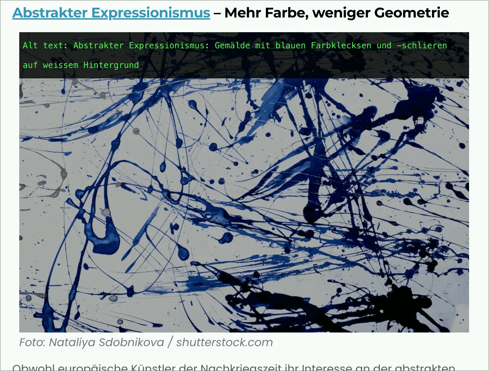
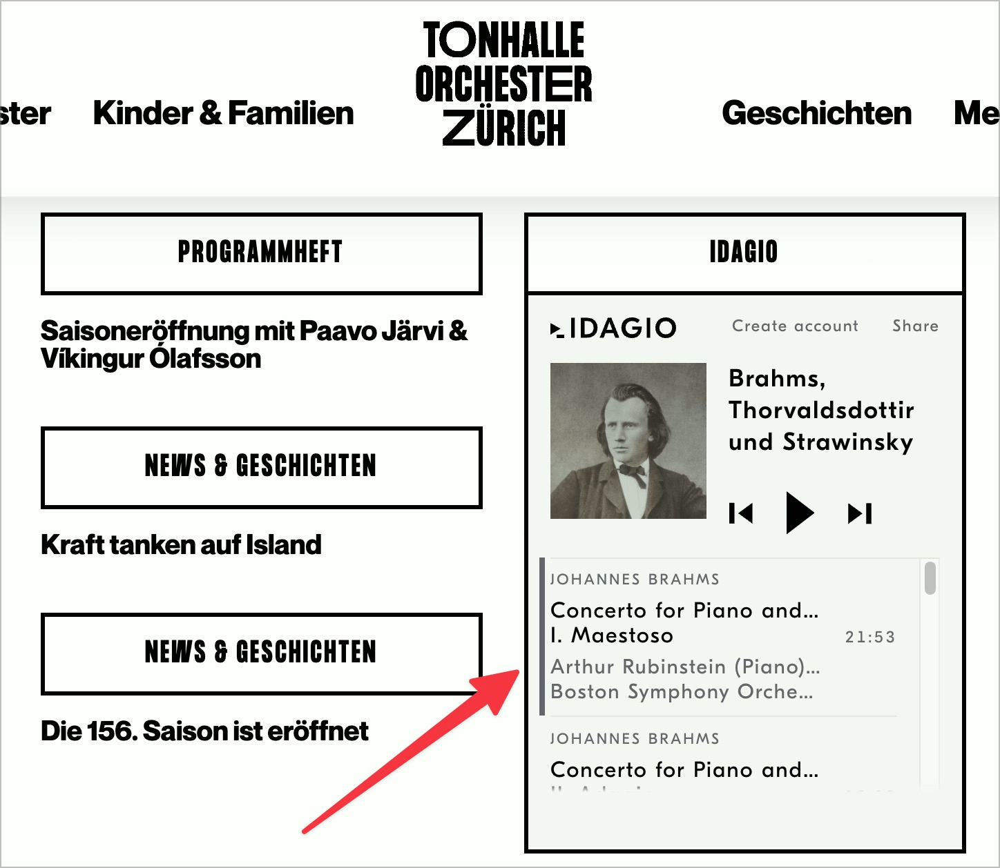

# ✅ Sensorische Nicht-Text-Inhalte

WCAG-Kriterium: [📜 1.1.1 Nicht-Text-Inhalt - A](..)

## Beschreibung

Sensorische Inhalte, die zwingend aus Nicht-Text-Inhalt bestehen, weil sie durch Worte nicht ausreichend ersetzt werden können (z.B. Musikaufführungen, Kunstwerke), weisen einen Alternativtext auf, der den Zweck des Nicht-Text-Inhalts beschreibt.

## Prüfmethode (in Kürze)

**Manuelle Prüfung:** Alternativtext mit Inhalt vergleichen: Beschreibt dieser den Zweck des Inhalts passend?

## Prüfmethode für Web (ausführlich)

### Prüf-Schritte

#### Bilder

1. Seite öffnen
1. [🏷️ Image Alt Text Viewer Extension](/de/tags/image-alt-text-viewer-extension) ausführen (oder in [🏷️ Web Developer Extension](/de/tags/web-developer-extension) unter "Images" → "Display Alt Attributes" wählen)
1. Sicherstellen, dass Grafiken mit rein sensorischem Inhalt einen passenden Alternativtext aufweisen
    - **🙂 Beispiel:** Ein abstraktes Gemälde hat den Alternativtext "Abstrakter Expressionismus: Gemälde mit blauen Farbklecksen und -schlieren auf weissem Hintergrund"
        - ⚠️ Die Beschreibung eines solchen Bildes kann herausfordernd sein und ist oft auch vom Kontext abhängig. Generell sollte nicht zu viel Interpretation vorweg genommen werden, sondern dem Nutzer die Interpretation überlassen werden.

#### Audio

1. Seite öffnen
1. Sicherstellen, dass Audio und Video mit rein sensorischem Inhalt einen passenden Alternativtext aufweisen
    - **🙂 Beispiel:** Ein Audio-Player der Webseite einer Musik-Universität bietet verschiedene klassische Stücke zum Abspielen an; jedes Stück wird in Worten kurz beschrieben, z.B. "Mondschein-Sonate von Beethoven, 1. Satz, gespielt auf klassischer Gitarre: Langsame, ruhige, melancholische Arpeggios in A-Moll, die langsam Spannung aufbauen, sich irgendwann auflösen und von neuem beginnen"
        - ⚠️ Die Beschreibung eines solchen Audios oder Videos kann herausfordernd sein und ist oft auch vom Kontext abhängig. Generell sollte nicht zu viel Interpretation vorweg genommen werden, sondern dem Nutzer die Interpretation überlassen werden.

## Screenshots typischer Fälle

