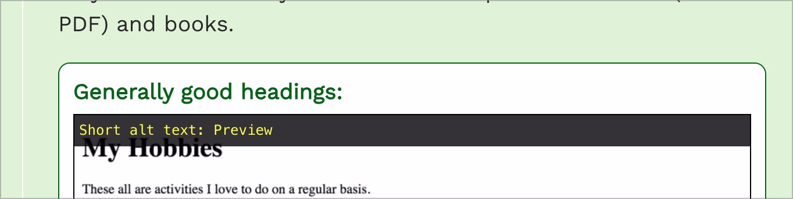

# ✅ Verlinkte Grafiken

WCAG-Kriterium: [📜 1.1.1 Nicht-Text-Inhalt - A](..)

## Beschreibung

Verlinkte Grafiken weisen einen Alternativtext auf, der Linkziel oder -zweck beschreibt.

## Prüfmethode (in Kürze)

**Web Developer Toolbar:** Images > Display Alt Attributes: Angezeigte Alternativtexte mit Bildern abgleichen.

## Prüfmethode für Web (ausführlich)

### Prüf-Schritte

1. Seite öffnen
1. [🏷️ Image Alt Text Viewer Extension](/de/tags/image-alt-text-viewer-extension) ausführen (oder in [🏷️ Web Developer Extension](/de/tags/web-developer-extension) unter "Images" → "Display Alt Attributes" wählen)
1. Sicherstellen, dass verlinkte Grafiken einen passenden Alternativtext aufweisen
    - ⚠️ Für verlinkte Seiten-Logos existiert [✅ Verlinktes Seiten-Logo](/de/wcag/1.1.1-nicht-text-inhalt/verlinktes-seiten-logo)!
    - **🙂 Beispiel:** Ein kleines Vorschau-Bild ist verlinkt auf eine Bildvariante mit voller Auflösung; der Alternativtext des Vorschau-Bilds ist "Ein Zebra, vergrössern" (oder "Vollbild", "Vollansicht", o.ä.)
        - **😡 Beispiel:** Bei "Ein Zebra" alleine fehlt der Linkzweck
        - **😡 Beispiel:** Bei "Vollansicht" alleine fehlt der Bildinhalt

⚠️ Bilder werden oft auch als Teil einer Card ([✅-112 ⚠️](javascript: alert('Wie gesagt: Verlinkung fehlgeschlagen... 🙄 Wahrscheinlich hast du eine falsche oder veraltete ID verwendet?')){title='Verlinkung fehlgeschlagen!'}) verlinkt, z.B. sogenannte "Teaser" auf der Startseite einer Zeitung. Je nach Art der Umsetzung kann es sehr unterschiedlich sein, wie ein sinnvoller Alternativtext dann aussieht, z.B. kann es auch Sinn machen, das Bild in dieser Ansicht als dekorativ ([✅ Dekorative Grafiken](/de/wcag/1.1.1-nicht-text-inhalt/dekorative-grafiken)) einzustufen.

## Prüfmethode für Mobile (Ergänzungen zu Web)

Sowohl auf Web-Views als auch native Inhalte 1:1 übertragbar.

## Prüfmethode für PDF (Ergänzungen zu Web)

### Prüf-Schritte
1. PDF mit [🏷️ Adobe Reader](/de/tags/adobe-reader) öffnen
1. Mit [🏷️ NVDA Screenreader](/de/tags/nvda-screenreader) vorlesen lassen und/oder
1. Mit [🏷️ PDF Accessibility Checker (PAC)](/de/tags/pdf-accessibility-checker-pac) testen und Screenreader-Vorschau öffnen
1. Prüfen, dass verlinkte Grafiken über einen aussagekräftigen Alternativtext verfügen (analog zu Web).

## Details zum blinden Testen

Eingeschränkt: es kann zwar evaluiert werden, ob eine Grafik einen Alternativtext hat oder nicht - ob dieser aber sinnvoll ist, ist oft schwer zu beurteilen.

## Screenshots typischer Fälle

