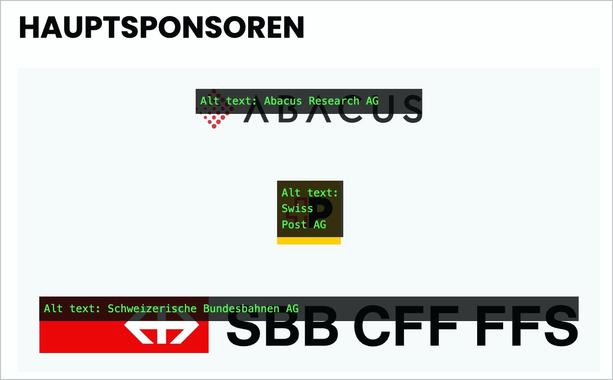

# ✅ Verlinkte Grafiken

## Beschreibung

Verlinkte Grafiken weisen einen Alternativtext auf, der Linkziel oder -zweck beschreibt.

## Prüfmethode (in Kürze)

**Web Developer Toolbar:** Images > Display Alt Attributes: Angezeigte Alternativtexte mit Bildern abgleichen.

## Prüfmethode für Web (ausführlich)

### Prüf-Schritte

1. Seite öffnen
1. **🏷️-32 Image Alt Text Viewer Extension** ausführen (oder in **🏷️-51 Web Developer Extension** unter "Images" → "Display Alt Attributes" wählen)
1. Sicherstellen, dass verlinkte Grafiken einen passenden Alternativtext aufweisen
    - ⚠️ Für verlinkte Seiten-Logos existiert **✅-10 Verlinktes Seiten-Logo**!
    - **🙂 Beispiel:** Ein kleines Vorschau-Bild ist verlinkt auf eine Bildvariante mit voller Auflösung; der Alternativtext des Vorschau-Bilds ist "Ein Zebra, vergrössern" (oder "Vollbild", "Vollansicht", o.ä.)
        - **😡 Beispiel:** Bei "Ein Zebra" alleine fehlt der Linkzweck
        - **😡 Beispiel:** Bei "Vollansicht" alleine fehlt der Bildinhalt

⚠️ Bilder werden oft auch als Teil einer Card ([✅-112 ⚠️](javascript: alert('Wie gesagt: Verlinkung fehlgeschlagen... 🙄 Wahrscheinlich hast du eine falsche oder veraltete ID verwendet?')){title='Verlinkung fehlgeschlagen!'}) verlinkt, z.B. sogenannte "Teaser" auf der Startseite einer Zeitung. Je nach Art der Umsetzung kann es sehr unterschiedlich sein, wie ein sinnvoller Alternativtext dann aussieht, z.B. kann es auch Sinn machen, das Bild in dieser Ansicht als dekorativ (**✅-13 Dekorative Grafiken**) einzustufen.

## Screenshots typischer Fälle

