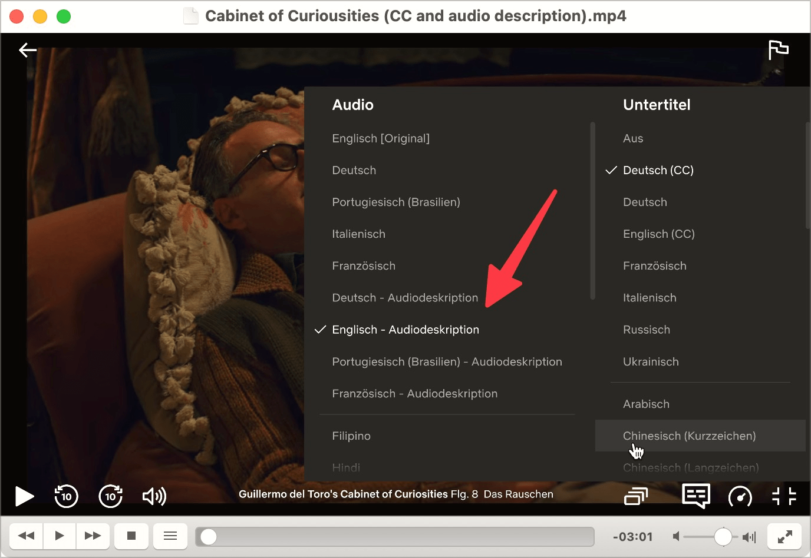

# ✅ Audiodeskription

WCAG-Kriterium: [📜 1.2.5 Audiodeskription (aufgezeichnet) - AA](..)

## Beschreibung

Für synchronisierte Video-Inhalte (Videos, in denen Audio- und Videospur zusammen die komplette Information ergeben) existieren Audiodeskriptionen für inhaltlich relevante, rein visuelle Inhalte. Für die Audiodeskription gilt: Wenn alle Informationen der Videospur bereits in der Audiospur enthalten sind, ist keine Audiodeskription erforderlich.

(Dieser Checkpunkt kann vernachlässigt werden, falls Konformitätsstufe A angestrebt wird und damit 1.2.3 in Kraft ist. Um Konformitätsstufe A zu erreichen, benötigen synchronisierte Video-Inhalte entweder eine Textabschrift oder eine Audiodeskription. Für Konformitätsstufe AA ist immer eine Audiodeskription erforderlich.)

## Prüfmethode (in Kürze)

**Manuelle Prüfung:** Audiodeskription mit Video-Inhalt vergleichen, inkl. rein visuell wahrnehmbare Handlung: Sind die Inhalte gleichwertig?

## Prüfmethode für Web (ausführlich)

### Prüf-Schritte

1. Seite öffnen
1. Video-Inhalt mit Audio starten
1. Falls rein visuell vermittelte, relevante Information vorhanden:
    - Kann Audio-Deskription aktiviert werden?
        - **🙂 Beispiel:** Audio-Deskription kann aktiviert werden → als alternative Tonspur
        - **😡 Beispiel:** Keine Audio-Deskription verfügbar
    - Sicherstellen, dass die entsprechenden Informationen in der Audio-Deskription bereit gestellt werden:
        - ⚠️ Audio-Deskription ist oft Geschmacksache: manchmal ist sie ausführlicher, manchmal eher knapp, da zwischen den Gesprächsfetzen in einem Film oft nur wenig Zeit bleibt für weitere Erklärungen
        - ⚠️ Audio-Deskription hat manchmal hohe Produktions-Qualität mit professionellem Sprecher, manchmal ist es nur eine Computerstimme
        - **🙂 Beispiel:** In einem Horrorfilm hört man eine Tür knarren → die Audio-Deskription sagt "Türe knarrt"
        - **🙄 Beispiel:** In einer Diskussion reden mehrere Gesprächs-Partner miteinander → es ist schwierig, die Stimmen auseinander zu halten
        - **😡 Beispiel:** In einer Diskussion werden zusätzliche Informationen zu den Gesprächs-Teilnehmenden nur per Text eingeblendet (aber nicht sprachlich angekündigt)

Hier einige Beispiele, in welchen Audio-Deskriptionen überflüssig sind:

- **🙂 Beispiel:** In einer Dokumentation beschreibt die Kommentatorin alle relevanten visuellen Informationen
- **🙂 Beispiel:** In einem Interview reden zwei Gesprächs-Partner miteinander

## Screenshots typischer Fälle

Many newer films on Netflix offer audio descriptions.
