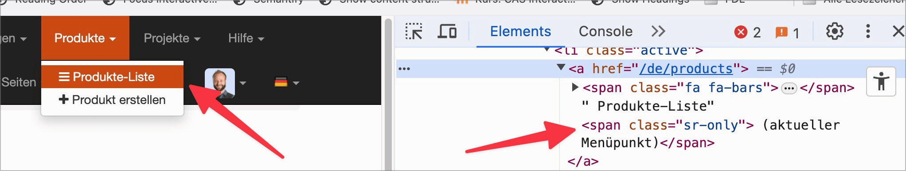
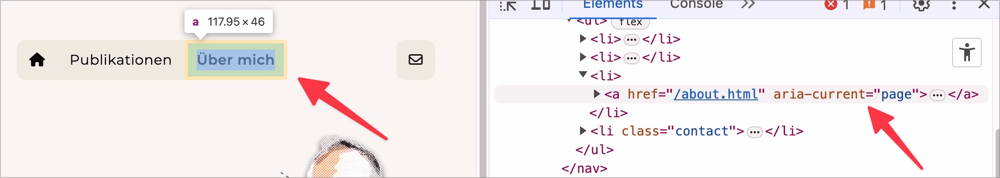

# ✅ Aktive Elemente

WCAG-Kriterium: [📜 1.3.1 Info und Beziehungen - A](..)

## Beschreibung

Aktive Elemente (z.B. der aktive Menüpunkt in einer Navigation) sind semantisch erkennbar ausgezeichnet, wenn sie visuell klar als aktiv erkennbar sind.

## Prüfmethode (in Kürze)

**Screenreader:** Erkunden und Ausgaben prüfen: Werden aktive Punkte als solche erkennbar ausgegeben?

## Prüfmethode für Web (ausführlich)

### Prüf-Schritte

1. Seite öffnen
1. Mit [🏷️ NVDA Screenreader](/de/tags/nvda-screenreader) Navigationen und ähnliche Elemente lesen und bedienen (oder mit [🏷️ DOM Inspektor](/de/tags/dom-inspektor) direkt untersuchen)
1. Sicherstellen, dass aktive Navigations-Punkte als solche angesagt werden
    - **🙂 Beispiel:** Eine Seite hat eine Navigation im Kopfbereich; das aktuell gewählte Navigations-Element wird als "aktuelle Seite", "aktiv", "gewählt" o.ä. angesagt
        - ⚠️ Es geht hier **nicht** darum, dass beim aktiven Wählen eines Eintrags der Screenreader ein Feedback gibt!
        - **😡 Beispiel:** Das Navigations-Element ist zwar visuell klar als gewählt erkennbar, aber der Screenreader gibt keinen entsprechenden Hinweis.
    - **🙂 Beispiel:** Bei einer Prozess-Navigation wird der aktive Schritt als "aktiv" o.ä. angesagt
        - ⚠️ Es geht hier **nicht** darum, dass das Element insgesamt als Prozess-Navigation erkennbar ist mit Screenreader (dafür existiert [✅ Breadcrumbs und Prozessanzeigen](/de/wcag/1.3.1-info-und-beziehungen/breadcrumbs-und-prozessanzeigen))!
        - **😡 Beispiel:** Der Screenreader gibt keinen entsprechenden Hinweis.

## Prüfmethode für Mobile (Ergänzungen zu Web)

Sowohl auf Web-Views als auch native Inhalte 1:1 übertragbar.

## Prüfmethode für PDF (Ergänzungen zu Web)

Auf PDF nicht anwendbar.

## Details zum blinden Testen

Ja (falls das Element insgesamt überhaupt als Prozessanzeige erkannt wird).

## Screenshots typischer Fälle

## Videos

- [🎬 Aktiver Menü-Eintrag bei Hochkontrast nicht mehr erkennbar - EWB](/de/videos/aktiver-menue-eintrag-bei-hochkontrast-nicht-mehr-erkennbar-ewb)
- [🎬 Aktiver Menü-Eintrag wird nicht angesagt - EWB](/de/videos/aktiver-menue-eintrag-wird-nicht-angesagt-ewb)