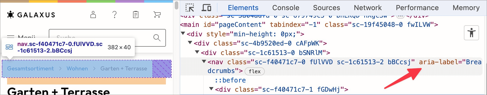

# ✅ Breadcrumbs und Prozessanzeigen

WCAG-Kriterium: [📜 1.3.1 Info und Beziehungen - A](..)

## Beschreibung

Breadcrumbs oder Prozessanzeigen sind auch nicht-visuell als solche erkennbar.

## Prüfmethode (in Kürze)

**Screenreader:** Erkunden und Ausgaben prüfen: Werden Elemente als solche erkennbar ausgegeben?

## Prüfmethode für Web (ausführlich)

### Prüf-Schritte

1. Seite öffnen
1. Mit [🏷️ NVDA Screenreader](/de/tags/nvda-screenreader) Breadcrumbs und Prozessanzeigen lesen und bedienen (oder mit [🏷️ DOM Inspektor](/de/tags/dom-inspektor) direkt untersuchen)
1. Sicherstellen, dass die Elemente als solches verstanden werden können
    - **🙂 Beispiel:** Der Breadcrumb wird als solches Angesagt, z.B. "Sie befinden sich hier" o.ä. (etwa durch einen Text, eine Überschrift oder `aria-label`)
        - **🙄 Beispiel:** Auch "Breadcrumb" wäre okay, aber diesen Begriff kennt lange nicht jeder Nutzer!
        - **😡 Beispiel:** Es wird nur eine Liste von Links angesagt ohne genaueren Kontext
    - **🙂 Beispiel:** Die Prozessanzeige wird als solches Angesagt, z.B. "Prozess-Schritte" o.ä.
        - ⚠️ Während Breadcrumbs den aktuell aktiven Eintrag nicht semantisch hervorheben müssen (da das letzte Element in der Auflistung stets das aktuell aktive Element ist), werden bei Prozessanzeigen oft auch zukünftige Schritte bereits angezeigt; insofern ist es wichtig, dass der aktive Punkt semantisch hervorgehoben wird → dafür existiert [✅ Aktive Elemente](/de/wcag/1.3.1-info-und-beziehungen/aktive-elemente)

## Screenshots typischer Fälle

