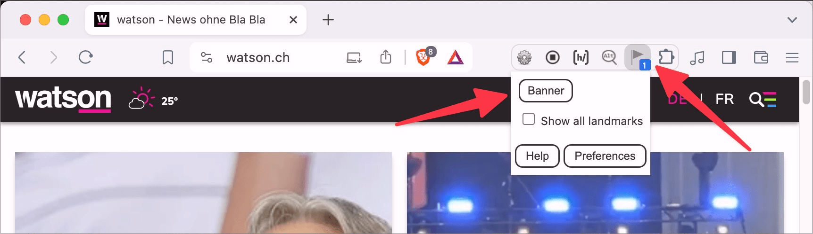

# ✅ Landmarks

WCAG-Kriterium: [📜 1.3.1 Info und Beziehungen - A](..)

## Beschreibung

Landmark Roles (HTML5-Elemente wie `<header>`, `<main>`, etc. sowie ARIA-Rollen) werden korrekt vergeben. Sie werden mit Bedacht verwendet und konsistent eingesetzt (möglichst keine Mehrfach-Verwendung derselben Rolle, konsistentes Auszeichnen aller wichtigen Seitenbereiche).

## Prüfmethode (in Kürze)

**Screenreader:** Erkunden und Ausgaben prüfen: Werden Seitenbereiche als solche erkennbar ausgegeben?

## Prüfmethode für Web (ausführlich)

### Prüf-Schritte

1. Seite öffnen
1. Mit [🏷️ NVDA Screenreader](/de/tags/nvda-screenreader) die Seitenbereiche durch-navigieren (oder [🏷️ Landmarks Extension](/de/tags/landmarks-extension) verwenden)
    - ⚠️ Eine Übersicht von Seitenbereichen (sog. Sprungmarken) kann mittels `Insert`+`F7` und dann `Alt`+`M` angezeigt werden
1. Sicherstellen, dass die Seitenbereiche sinnvoll mit Landmarks ausgezeichnet sind
    - **🙂 Beispiel:** Der Kopfbereich, Hauptbereich, Fussbereich sowie Navigation(en) werden entsprechend angesagt
        - ⚠️ Die Terminologie kann zwischen Screenreadern variieren
        - **😡 Beispiel:** Diese Bereiche werden nicht wie gewünscht angesagt

### Einsatz von Landmarks

Beim Einsatz von Landmarks ist man relativ frei. Folgendes gilt es zu beachten:

- Es darf nur einen einzigen Hauptbereich (`<main>`) existieren
- Am besten existieren auch nur ein einziger Kopf- (`<header>`) und Fussbereich (`<footer>`)
- Auch wenn es dedizierte Landmarks für Formulare (`role="form"`) und Suchbereiche (`role="search"`) gibt, sind diese eher selten anzutreffen und werden nicht gefordert
    - ⚠️ Tatsächlich wird ein `<form>` erst durch `role="form"` zu einem Landmark!
- Weitere Landmarks wie `<article>` oder `<section>` werden von Screenreadern aktuell nicht explizit angesagt
    - ⚠️ Sie zu nutzen gilt dennoch als "Good Practice" zum Strukturieren des Codes

### Landmarks vs. Überschriften

Es gibt Stimmen, die darauf hinweisen, dass Landmarks ein ausreichender Ersatz für Überschriften sein können:

- Ein Kopfbereich benötigt nicht unbedingt eine (ggf. visuell versteckte) Überschrift
- Ein `<article aria-label="Das könnte Sie noch interessieren">` kann eine "richtige" Überschrift (`<h3>Das könnte...</h3>`) überflüssig machen

Wir empfehlen unseren Kunden stets, möglichst dennoch (ggf. visuell versteckte) Überschriften zu nutzen, da Landmarks nur von wenigen Screenreader-Nutzern eingesetzt werden.

Zahlen vom [WebAIM Screen Reader Survey #10](https://webaim.org/projects/screenreadersurvey10/):

- Navigieren via Überschriften: 71.6%
- Navigieren via Landmarks: 3.7%

## Prüfmethode für Mobile (Ergänzungen zu Web)

Sowohl auf Web-Views als auch native Inhalte 1:1 übertragbar.

## Prüfmethode für PDF (Ergänzungen zu Web)

Auf PDF nicht anwendbar.

## Details zum blinden Testen

Ja: insbesondere das Fehlen von Landmarks kann natürlich erkannt werden. Ob vergebene Landmarks sinnvoll sind (und ob alle Inhalte sinnvoll darauf verteilt sind), ist ggf. schwieriger einzuschätzen.

## Screenshots typischer Fälle

