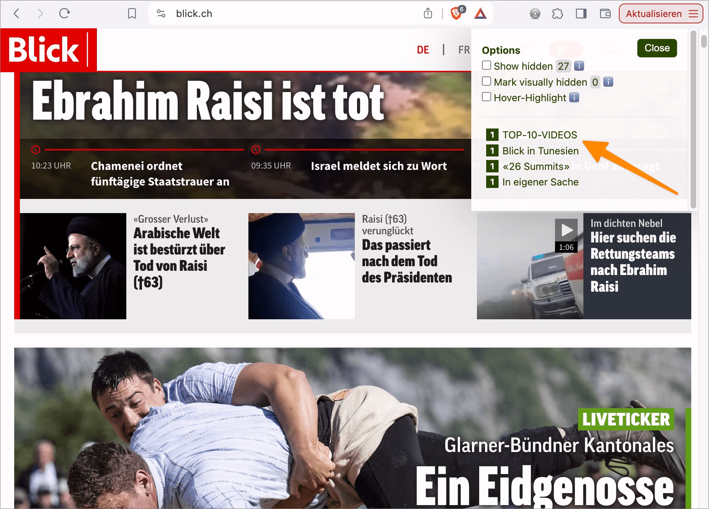

# ✅ Eigene Überschrift

WCAG-Kriterium: [📜 1.3.1a Überschriften-Struktur](..)

## Beschreibung

Eigenständige Seitenbereiche weisen eine eigene Überschrift auf, da sie sonst der vorausgehenden Überschrift falsch untergeordnet werden. Für Inhalts- und Funktionsblöcke wie Kopf- und Fussbereich, Navigation, Breadcrumb, etc. können visuell versteckte Überschriften eingesetzt werden.

## Prüfmethode (in Kürze)

**Bookmarklet h123:** Ausführen und mit Seite abgleichen: Hat jeder Seitenbereich eine Überschrift? Ist deren Beschriftung zutreffend?

## Prüfmethode für Web (ausführlich)

### Prüf-Schritte

1. Seite öffnen
1. [🏷️ H123 Bookmarklet](/de/tags/h123-bookmarklet) ausführen
1. Sicherstellen, dass alle Seitenbereiche eine eigene Überschrift haben:
    - **🙂 Beispiel:** Der Kopf-Bereich hat eine visuell versteckte Überschrift `<h1>Kopfbereich</h1>` (oder auch `<h2>`, da die Seite nicht zwingend mit einer `<h1>` starten muss)
    - **🙂 Beispiel:** Haupt-Inhalt hat eine `<h1>Meine Hobbys</h1>`
    - **🙂 Beispiel:** Im Kopfbereich befinden sich sowohl die Nutzer-Navigation (Login) als auch die Inhalts-Navigation: Es hat eine übergeordnete `<h2>Navigation</h2>` und darunter eine `<h3>Nutzer-Navigation</h3>` sowie `<h3>Inhalts-Navigation</h3>`.
    - **🙂 Beispiel:** Die Nutzer-Navigation (Login) befindet sich im Kopfbereich und hat eine `<h2>Nutzer-Navigation</h2>`; die Inhalts-Navigation befindet nicht im Kopfbereich (sondern z.B. links neben dem Haupt-Inhalt) und hat eine `<h2>Inhalts-Navigation</h2>`.
    - **🙂 Beispiel:** Ein Bereich bewirbt ähnliche Shopping-Artikel und hat eine `<h2>Dies könnte Sie auch interessieren</h2>`
    - **😡 Beispiel:** Die Navigation hat keine Überschrift
    - **😡 Beispiel:** Ein Bereich mit ähnlichen Shopping-Artikeln hat keine Überschrift

### Nachprüfen mit Screenreader

Bei zweifelhaftem Code (z.B. Einsatz von `role="heading"`) sollte besser mit [🏷️ NVDA Screenreader](/de/tags/nvda-screenreader) nachgeprüft werden:

- Inhalte mit `Hoch`/`Runter` lesen und Vorhandensein von Überschriften prüfen.

⚠️ Denn: viele Fehler findet man oft auch ohne Screenreader, z.B. wenn die Semantik komplett fehlt oder offensichtlich falsch ist. Wenn Semantik aber grundsätzlich **vorhanden scheint**, lässt sich deren Korrektheit und Sinnhaftigkeit oft nur mit Screenreader final beurteilen.

### Landmarks und `aria-label`

Gemäss WCAG reichen für z.B. Kopf- und Fussbereich auch Landmarks ([✅ Landmarks](/de/wcag/1.3.1-info-und-beziehungen/landmarks)) mit `aria-label` ([🏷️ aria-label, aria-labelledby](/de/tags/aria-label-aria-labelledby)). Wir empfehlen aber stets dringend, alles mit (ggf. visuell versteckten, [🏷️ Inhalte rein visuell verstecken](/de/tags/inhalte-rein-visuell-verstecken)) Überschriften zu strukturieren, da dies Screenreader-Nutzer am meisten verwenden.

Zahlen vom [WebAIM Screen Reader Survey #10](https://webaim.org/projects/screenreadersurvey10/):

- Navigieren via Überschriften: 71.6%
- Navigieren via Landmarks: 3.7%

## Prüfmethode für Mobile (Ergänzungen zu Web)

Sowohl auf Web-Views als auch native Inhalte 1:1 übertragbar; zum Prüfen mit Wisch-Bewegung durch Inhalte navigieren.

## Prüfmethode für PDF (Ergänzungen zu Web)

Visuell hervorgehobene Inhalte in einem PDF, wie zum Beispiel eine Sidebar oder eine Textbox, müssen eine einleitende Überschrift haben.

## Details zum blinden Testen

Überschriften sind für Blinde besonders wichtig!

## Screenshots typischer Fälle

## Videos

- [🎬 Fehlende Zwischen-Überschrift und Ebenen-Sprung - Mozilla](/de/videos/fehlende-zwischen-ueberschrift-und-ebenen-sprung-mozilla)
- [🎬 Unvollständige Überschriften (kein H1, falsch umgesetzt, etc.) - Blick](/de/videos/unvollstaendige-ueberschriften-kein-h1-falsch-umgesetzt-etc-blick)
- [🎬 Unvollständige Überschriften (kein H1, falsch umgesetzt, etc.) - Brack](/de/videos/unvollstaendige-ueberschriften-kein-h1-falsch-umgesetzt-etc-brack)
- [🎬 Vorbildliche Überschriften (inkl. versteckte) - MySwitzerland](/de/videos/vorbildliche-ueberschriften-inkl-versteckte-myswitzerland)
- [🎬 Vorbildliche Überschriften (inkl. versteckte) - WOZ](/de/videos/vorbildliche-ueberschriften-inkl-versteckte-woz)