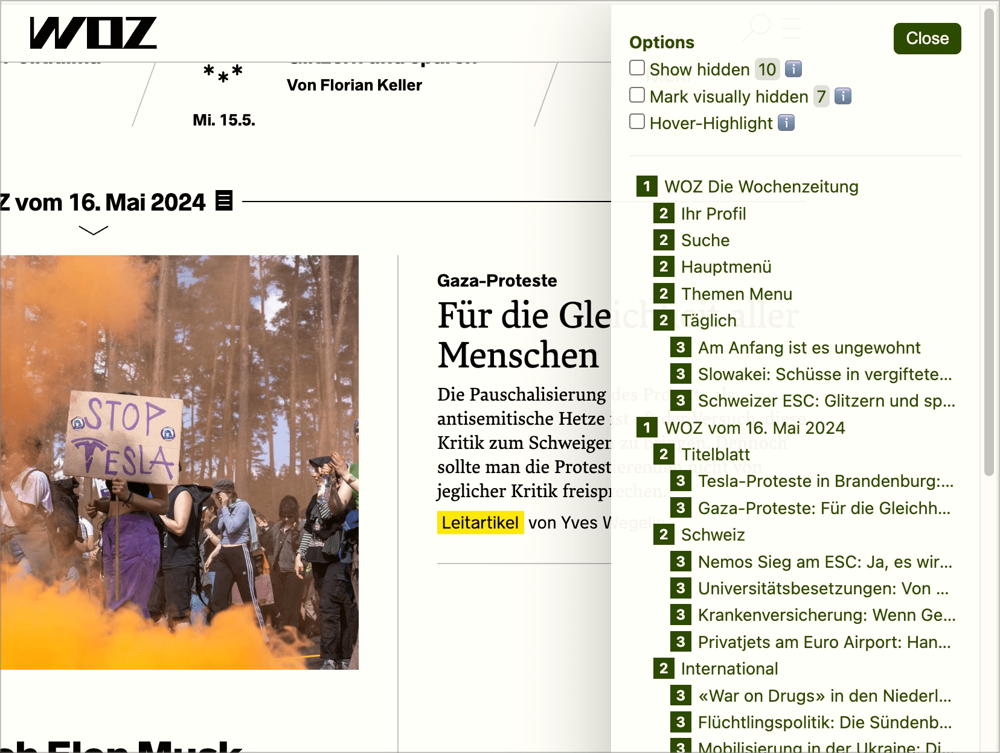
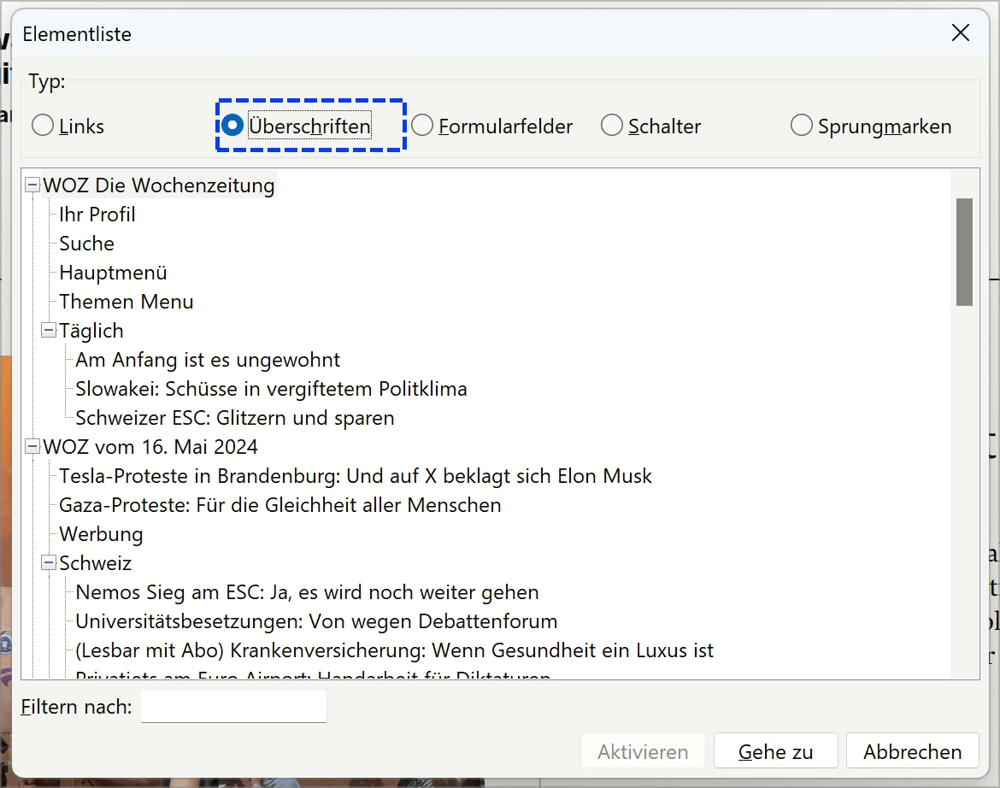

# ✅ Hierarchie existierender Überschriften

WCAG-Kriterium: [📜 1.3.1a Überschriften-Struktur](..)

## Beschreibung

Die Hierarchie der Überschriften-Ebenen ist inhaltlich-logisch korrekt und vermittelt die Struktur der Inhalte.

## Prüfmethode (in Kürze)

**Bookmarklet h123:** Ausführen und mit Seite abgleichen: Ist die Hierarchie in sich logisch korrekt?

## Prüfmethode für Web (ausführlich)

### Prüf-Schritte

1. Seite öffnen
1. [🏷️ H123 Bookmarklet](/de/tags/h123-bookmarklet) ausführen
1. Sicherstellen, dass Hierarchie der Überschriften inhaltlich korrekt
    - ⚠️ Es geht hier darum, dass die **existierende** Überschriften-Struktur Sinn macht (und nicht, ob z.B. Überschriften fehlen o.ä. → auch wenn fehlende Überschriften natürlich schnell zu sinnfreien Überschriften-Strukturen führen)
    - **🙂 Beispiel:** Auf `<h1>Meine Hobbys</h1>` folgen `<h2>Fussball spielen</h2>` und `<h2>Kochen</h2>`
    - **🙂 Beispiel:** Auf `<h2>Navigation</h2>` folgen `<h3>Inhalts-Navigation</h3>` und `<h3>Nutzer-Navigation (Login)</h3>`
    - **😡 Beispiel:** Auf `<h1>Meine Hobbys</h1>` folgen `<h1>Fussball spielen</h1>` und `<h1>Kochen</h1>`
    - **😡 Beispiel:** Auf `<h2>Navigation</h2>` folgen `<h1>Inhalts-Navigation</h1>` und `<h2>Nutzer-Navigation (Login)</h2>`

### Nachprüfen mit Screenreader

Bei zweifelhaftem Code (z.B. Einsatz von `role="heading"`) sollte besser mit [🏷️ NVDA Screenreader](/de/tags/nvda-screenreader) nachgeprüft werden:

- `Insert`+`F7` zum Anzeigen der Elementliste
- Dann `Alt`+`H` für Überschriften

⚠️ Denn: viele Fehler findet man oft auch ohne Screenreader, z.B. wenn die Semantik komplett fehlt oder offensichtlich falsch ist. Wenn Semantik aber grundsätzlich **vorhanden scheint**, lässt sich deren Korrektheit und Sinnhaftigkeit oft nur mit Screenreader final beurteilen.

## Screenshots typischer Fälle

