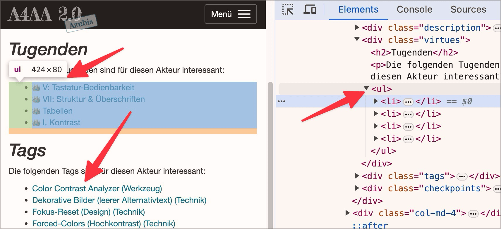

# ✅ Aufzählungen semantisch korrekt

WCAG-Kriterium: [📜 1.3.1b Aufzählungen und Listen](..)

## Beschreibung

Aufzählungen sind semantisch korrekt als Listen (`<ul>`, `<ol>`, `<dl>`) formatiert.

## Prüfmethode (in Kürze)

**Bookmarklet "Inhalte gegliedert":** Ausführen und mit Seite abgleichen: Sind Aufzählungen als solche ausgezeichnet?

## Prüfmethode für Web (ausführlich)

### Prüf-Schritte

1. Seite öffnen
1. [🏷️ Inhalte gegliedert Bookmarklet](/de/tags/inhalte-gegliedert-bookmarklet) ausführen
1. Sicherstellen, dass Listen semantisch korrekt umgesetzt
    - **🙂 Beispiel:** Eine vertikale Seiten-Navigation ist als `<ul>` oder `<ol>` ausgezeichnet
    - **🙂 Beispiel:** Eine horizontale Aneinander-Reihung von Social-Media-Links ist als `<ul>` oder `<ol>` ausgezeichnet
    - **😡 Beispiel:** Eine Einkaufs-Liste ist nur mittels Plain-Text-Bindestrichen (z.B. `- Brot`) und Umbrüchen (` `) umgesetzt

### Nachprüfen mit Screenreader

Eine Liste muss immer aus einem Container (`<ul>` oder `<ol>`) bestehen und darf als direkte Kind-Elemente nur `<li>` beinhalten! Bei zweifelhaftem Code (z.B. Einsatz von `role="list"`) sollte besser mit [🏷️ NVDA Screenreader](/de/tags/nvda-screenreader) nachprüft werden:

- `L` drücken, um Listen direkt anzuspringen
- `I` drücken, um Punkte innerhalb einer Liste direkt anzuspringen

⚠️ Denn: viele Fehler findet man oft auch ohne Screenreader, z.B. wenn die Semantik komplett fehlt oder offensichtlich falsch ist. Wenn Semantik aber grundsätzlich **vorhanden scheint**, lässt sich deren Korrektheit und Sinnhaftigkeit oft nur mit Screenreader final beurteilen.

## Prüfmethode für Mobile (Ergänzungen zu Web)

Auf hybride Inhalte 1:1 anwendbar.

Native Apps scheinen aber keine spezifischen Listen-Elemente zu kennen.

## Prüfmethode für PDF (Ergänzungen zu Web)

### Prüf-Schritte
1. PDF mit [🏷️ Adobe Reader](/de/tags/adobe-reader) öffnen
1. Mit [🏷️ NVDA Screenreader](/de/tags/nvda-screenreader) vorlesen lassen und/oder
1. Mit [🏷️ PDF Accessibility Checker (PAC)](/de/tags/pdf-accessibility-checker-pac) testen und Screenreader-Vorschau öffnen und/oder
1. Mit [🏷️ Adobe Acrobat](/de/tags/adobe-acrobat) (falls vorhanden) öffnen und Tag-Baum untersuchen
1. Analog zu Web: Prüfen, ob Listen korrekt als solche ausgegeben und/oder getaggt sind. Bei Listen, die über mehrere PDF-Seiten gehen, zusätzlich überprüfen, ob alle zusammengehörenden Listenelemente sich in derselben Liste befinden.

### Tag-Struktur von Listen
Eine korrekt getaggte Liste besteht aus folgenden Tags: `<L>`, `<LI>`und `<LBody>`

`<L>` steht für "List" und ist das umschliessende Containerelement. `<LI>` steht für "List Item", `<LBody>`steht für "List Item Body". Jedes Listenelement befindet sich in einem eigenen `<LI>` und dem darin eingeschlossenen `<LBody>`-Tag. Jedes Listenelement kann zusätzlich ein `<Lbl>`enthalten. `<Lbl>`steht für "List Item Label" und wird zum Beispiel für das Aufzählungszeichen oder die Nummerierung verwendet.

## Details zum blinden Testen

Listen sind für Blinde besonders wichtig!

## Screenshots typischer Fälle

## Videos

Keine Videos verfügbar.
