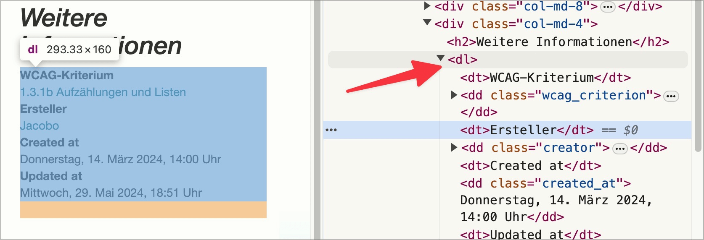

# ✅ Glossare

WCAG-Kriterium: [📜 1.3.1b Aufzählungen und Listen](..)

## Beschreibung

Glossare und ähnliche Informationslisten sind als Definitionslisten formatiert.

## Prüfmethode (in Kürze)

**Bookmarklet "Inhalte gegliedert":** Ausführen und mit Seite abgleichen.

## Prüfmethode für Web (ausführlich)

### Prüf-Schritte

1. Seite öffnen
1. **🏷️-44 Inhalte gegliedert Bookmarklet** ausführen
1. Sicherstellen, dass Definitions-Listen als `<dl>` umgesetzt sind
    - **🙂 Beispiel:** Ein Glossar ist als `<dl>` umgesetzt: der Begriff (Term) ist als `<dt>`, die Erläuterung (Definition) als `<dd>` ausgezeichnet
    - **🙂 Beispiel:** Ein Glossar ist als `<ul>` umgesetzt: der Begriff ist mittels `<strong>` rein visuell von der Erläuterung abgesetzt

### Nachprüfen mit Screenreader

⚠️ Eine Liste muss immer aus einem Container (`<ul>` oder `<ol>`) bestehen und darf als direkte Kind-Elemente nur `<li>` beinhalten! Bei zweifelhaftem Code (z.B. Einsatz von `role="list"`) sollte besser mit **🏷️-13 NVDA Screenreader** nachgeprüft werden:

- `L` drücken, um Listen (auch Definitions-Listen) direkt anzuspringen
- `I` drücken, um Punkte innerhalb einer Liste direkt anzuspringen

⚠️ Denn: viele Fehler findet man oft auch ohne Screenreader, z.B. wenn die Semantik komplett fehlt oder offensichtlich falsch ist. Wenn Semantik aber grundsätzlich **vorhanden scheint**, lässt sich deren Korrektheit und Sinnhaftigkeit oft nur mit Screenreader final beurteilen.

## Screenshots typischer Fälle

