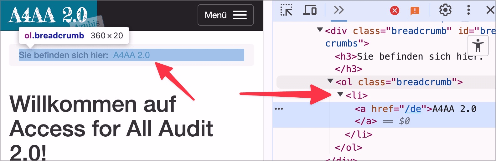

# ✅ Listen mit nur einem Eintrag

WCAG-Kriterium: [📜 1.3.1b Aufzählungen und Listen](..)

## Beschreibung

Listen mit nur einem Eintrag werden vermieden (ausser sie werden automatisch generiert: etwa eine Auflistung von Schlagwörtern, wo manchmal auch nur ein einzelnes Schlagwort vorhanden ist).

## Prüfmethode (in Kürze)

**Bookmarklet "Inhalte gegliedert":** Ausführen und mit Seite abgleichen: Hat jede Liste mindestens zwei Elemente?

## Prüfmethode für Web (ausführlich)

### Prüf-Schritte

1. Seite öffnen
1. [🏷️ Inhalte gegliedert Bookmarklet](/de/tags/inhalte-gegliedert-bookmarklet) ausführen
1. Sicherstellen, dass keine Listen mit nur einem Eintrag existieren
    - **🙂 Beispiel:** Eine automatisch generierte Liste mit Stichworten zu einem Video enthält nur ein einziges Stichwort
        - ⚠️ In solchen Fällen, wo mehrere Elemente ausgegeben werden können, aber manchmal auch nur ein einzelnes Element ausgegeben wird (eben z.B. mehrere Stichwörter, aber mal auch nur eines oder gar keines) ist es okay, eine Liste mit nur einem einzigen Eintrag anzuzeigen.
    - **😡 Beispiel:** Ein Element wurde als Liste ausgezeichnet, obwohl es immer nur einen Eintrag enthält
        - ⚠️ In solchen Fällen werden Listen meist nur verwendet, weil man durch sie ein gewünschtes visuelles Aussehen erreicht, aber es geht gar nicht um die Darstellung einer Liste ansich! Hier soll also keine Liste aus reiner Bequemlichkeit eingesetzt werden, sondern ein passendes Element (`
`, `
` o.ä.) mit dem gewünschten Aussehen definiert werden.

### Nachprüfen mit Screenreader

Eine Liste muss immer aus einem Container (`<ul>` oder `<ol>`) bestehen und darf als direkte Kind-Elemente nur `<li>` beinhalten! Bei zweifelhaftem Code (z.B. Einsatz von `role="list"`) sollte besser mit [🏷️ NVDA Screenreader](/de/tags/nvda-screenreader) nachprüft werden:

- `L` drücken, um Listen direkt anzuspringen
- `I` drücken, um Punkte innerhalb einer Liste direkt anzuspringen

⚠️ Denn: viele Fehler findet man oft auch ohne Screenreader, z.B. wenn die Semantik komplett fehlt oder offensichtlich falsch ist. Wenn Semantik aber grundsätzlich **vorhanden scheint**, lässt sich deren Korrektheit und Sinnhaftigkeit oft nur mit Screenreader final beurteilen.

## Screenshots typischer Fälle

