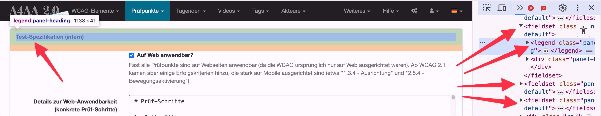

# ✅ Fieldset / Legend

WCAG-Kriterium: [📜 1.3.1c Formular-Beziehungen](..)

## Beschreibung

In umfangreichen Formularen werden inhaltlich zusammengehörige Formularfelder mittels `<fieldset>`/`<legend>`-Kombination gruppiert.

## Prüfmethode (in Kürze)

In umfangreichen Formularen werden inhaltlich zusammengehörige Formularfelder mittels `<fieldset>`/`<legend>`-Kombination gruppiert.

## Prüfmethode für Web (ausführlich)

### Prüf-Schritte

1. Seite mit Formular-Elementen öffnen
1. [🏷️ Inhalte gegliedert Bookmarklet](/de/tags/werkzeuge/bookmarklets/inhalte-gegliedert-bookmarklet) ausführen (oder mit [🏷️ DOM Inspektor](/de/tags/werkzeuge/dom-inspektor) untersuchen)
1. Sicherstellen, dass Gruppen von Formular-Elementen als `<fieldset>`/`<legend>` umgesetzt sind
    - **🙂 Beispiel:** Ein einfaches Kontaktformular (mit Name, Email und Nachricht) wird **nicht** mit `<fieldset>`/`<legend>` gruppiert.
        - ⚠️ Es besteht **kein** grundsätzlicher Zwang zum Einsatz von `<fieldset>`/`<legend>`
    - **🙂 Beispiel:** Ein einfaches Kontaktformular wird **nicht** von `<fieldset>`/`<legend>` umschlossen; es enthält aber eine Gruppe von Checkboxen ("Wie haben Sie von uns gehört?"), und diese wiederum sind von `<fieldset>`/`<legend>` umschlossen.
        - ⚠️ Mehrere Radiobuttons und Checkboxen müssen immer mit `<fieldset>`/`<legend>` gruppiert sein
    - **🙂 Beispiel:** Eine einzelne Checkbox "Ich habe die AGBs gelesen" wird **nicht** von `<fieldset>`/`<legend>` umschlossen
    - **🙂 Beispiel:** Die Lieferadresse befindet sich in einem eigenen `<fieldset>`/`<legend>`, die Rechnungsadresse ebenfalls.
    - **🙂 Beispiel:** Eine Gruppe von zusammen gehörenden Checkboxen (z.B. "Meine Hobbys") bzw. Radiobuttons (z.B. "Lieblingsgericht") befinden sich in einem `<fieldset>`/`<legend>`
        - ⚠️ Es ist durchaus erlaubt, `<fieldset>`s ineinander zu verschachteln! Ein `<fieldset>` "Persönliche Infos" (mit unterschiedlichsten Eingabefeldern) könnte ein weiteres `<fieldset>` "Liefer-Adresse" (mit unterschiedlichsten Eingabefeldern) beinhalten, welches wiederum ein `<fieldset>` "Geschlecht" (mit Radiobuttons) beinhaltet.
        - ⚠️ `<fieldset>`/`<legend>`s können visuell beliebig gestaltet sein: sie können in umfangreichen Formularen z.B. auch als Ersatz für Überschriften dienen; die `<legend>` darf zudem eine Überschrift enthalten, z.B. `<legend><h3>Rechnungs-Adresse</h3></legend>`.
    - **😡 Beispiel:** Eine Gruppe von Eingabefeldern wird nur durch eine Überschrift (z.B. `<h3>Lieferadresse</h3>` oder `
Meine Hobbys:
`) eingeleitet (ohne `<fieldset>`/`<legend>`).
        - ⚠️ Wie oben gesagt: bei einfachen Formularen (z.B. Kontaktformular) kann das aber ggf. in Ordnung sein
    - **😡 Beispiel:** Eine Gruppe von Eingabefeldern wird zwar von einem `<fieldset>` umrahmt, es hat aber keine `<legend>`.
    - **😡 Beispiel:** Ein `<fieldset>` hat zwar eine `<legend>`, diese ist aber nicht das erste Kind-Element
        - ⚠️ Das `<legend>` muss immer das erste Kind-Element im `<fieldset>` sein!

### Nachprüfen mit Screenreader

Bei komplexen Formularen oder zweifelhaftem Code (z.B. Einsatz von `role="group"`) sollte besser mit [🏷️ NVDA Screenreader](/de/tags/werkzeuge/screenreader/desktop-screenreader/nvda-screenreader) nachgeprüft werden:

- `Tab` (oder auch `F` oder `I`) drücken, um erstes Eingabefeld in einem `<fieldset>` anzuspringen
- Dann sicherstellen, dass der Screenreader nun auch dessen `<legend>` vorliest

⚠️ Denn: viele Fehler findet man oft auch ohne Screenreader, z.B. wenn die Semantik komplett fehlt oder offensichtlich falsch ist. Wenn Semantik aber grundsätzlich **vorhanden scheint**, lässt sich deren Korrektheit und Sinnhaftigkeit oft nur mit Screenreader final beurteilen.

## Screenshots typischer Fälle

