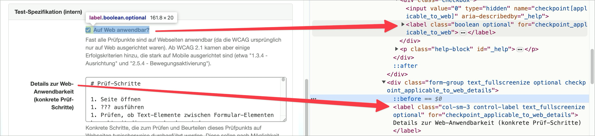

# ✅ Formularfelder Labels

WCAG-Kriterium: [📜 1.3.1c Formular-Beziehungen](..)

## Beschreibung

Formularfelder weisen korrekt verknüpfte Labels auf.

## Prüfmethode (in Kürze)

**Maus:** Auf Label klicken und prüfen, ob der Tastatur-Fokus das Eingabefeld anspringt/anwählt.

**Screenreader:** Durch Eingabefelder navigieren mittels Tab-Taste und prüfen, ob `<label>`-Elemente dabei auch ausgegeben werden.

## Prüfmethode für Web (ausführlich)

### Prüf-Schritte

1. Seite mit Formular-Elementen öffnen
1. Bei jedem Eingabefeld auf das Label klicken (falls sichtbar)
1. Sicherstellen, dass Eingabefelder und Labels korrekt verbunden sind
    - ⚠️ Laut WCAG kann zum Benennen eines Eingabefelds auch ein `aria-label` direkt darauf gesetzt werden; zudem ist ein Label manchmal visuell versteckt. In beiden Fällen ist Klicken nicht möglich zum Testen, sondern der Screenreader muss eingesetzt werden (siehe unten).
    - **🙂 Beispiel:** Beim Klick auf "Vorname" springt der Fokus ins entsprechende Textfeld
        - **😡 Beispiel:** Der Fokus springt nicht hinein
    - **🙂 Beispiel:** Beim Klick auf "Ich habe die AGBs gelesen" wird die entsprechende Checkbox aktiviert
        - **😡 Beispiel:** Die Checkbox wird nicht aktiviert

### Nachprüfen mit Screenreader

Bei visuell ungewöhnlichen Formularen (z.B. teilweise keine visuell sichtbaren Labels) oder zweifelhaftem Code (z.B. Einsatz von `aria-label`) sollte besser mit [🏷️ NVDA Screenreader](/de/tags/nvda-screenreader) nachgeprüft werden:

- `Tab` (oder auch `F` oder `I`) drücken, um von Eingabefeld zu Eingabefeld zu springen
- Dann sicherstellen, dass der Screenreader das Label des Felds vorliest

⚠️ Denn: viele Fehler findet man oft auch ohne Screenreader, z.B. wenn die Semantik komplett fehlt oder offensichtlich falsch ist. Wenn Semantik aber grundsätzlich **vorhanden scheint**, lässt sich deren Korrektheit und Sinnhaftigkeit oft nur mit Screenreader final beurteilen.

## Screenshots typischer Fälle

