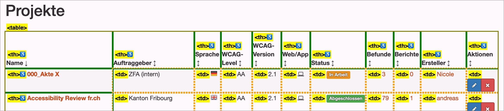

# ✅ Tabelle semantisch korrekt

WCAG-Kriterium: [📜 1.3.1d Tabellarische Daten](..)

## Beschreibung

Daten, welche eindeutig tabellarischen Charakter aufweisen (also keine Layout-Tabellen), sind semantisch korrekt als Tabelle formatiert und enthalten möglichst keine komplexen semantischen Strukturen, z.B. Überschriften-Elemente (`<h1>` bis `<h6>`).

## Prüfmethode (in Kürze)

**Web Developer Toolbar:** Outline > "Show Element Tag Names" aktivieren > Outline Table Cells: Tabelle erkunden und prüfen, ob sie semantisch korrekt formatiert sind.

## Prüfmethode für Web (ausführlich)

### Prüf-Schritte

1. Seite öffnen
1. [🏷️ Tables Bookmarklet](/de/tags/tables-bookmarklet) ausführen
1. Sicherstellen, dass Tabellen-artige Elemente auch tatsächlich als `<table>` umgesetzt sind
    - **🙂 Beispiel:** Eine Tabelle ist korrekt als `<table>` umgesetzt
    - **🙄 Beispiel:** Eine Tabelle ist als `
` umgesetzt
        - ⚠️ Mit dem korrekten Einsatz von ARIA (`role="table"` oder `role="grid"`) kann auch ein `
`-Konstrukt barrierefrei gemacht werden! Dies ist aber relativ kompliziert und wird ggf. nicht von allen Browsern und Screenreadern unterstützt. Wir empfehlen unseren Kunden, wenn möglich stets klassisches HTML zu verwenden!
    - **😡 Beispiel:** Eine Tabelle ist als `
`-Konstrukt umgesetzt (ohne ARIA).

### Nachprüfen mit Screenreader

Bei zweifelhaftem Code (z.B. Einsatz von `role="table"` oder `role="grid"`) sollte besser mit [🏷️ NVDA Screenreader](/de/tags/nvda-screenreader) nachgeprüft werden:

- Mit `T` zu Tabelle springen
- Mit `Ctrl`+`Alt`+`Pfeile` durch die Zellen navigieren (quasi wie in Excel) und sicherstellen, dass jeweils die korrekten Zeilen-Header angesagt werden

⚠️ Denn: viele Fehler findet man oft auch ohne Screenreader, z.B. wenn die Semantik komplett fehlt oder offensichtlich falsch ist. Wenn Semantik aber grundsätzlich **vorhanden scheint**, lässt sich deren Korrektheit und Sinnhaftigkeit oft nur mit Screenreader final beurteilen.

## Prüfmethode für Mobile (Ergänzungen zu Web)

Sowohl auf Web-Views als auch native Inhalte 1:1 übertragbar.

## Prüfmethode für PDF (Ergänzungen zu Web)

### Prüf-Schritte
1. PDF mit [🏷️ Adobe Reader](/de/tags/adobe-reader) öffnen
1. Mit [🏷️ NVDA Screenreader](/de/tags/nvda-screenreader) vorlesen lassen und/oder
1. Mit [🏷️ PDF Accessibility Checker (PAC)](/de/tags/pdf-accessibility-checker-pac) testen und Screenreader-Vorschau öffnen und/oder
1. Mit [🏷️ Adobe Acrobat](/de/tags/adobe-acrobat) (falls vorhanden) öffnen und Tag-Baum untersuchen
1. Analog zu Web: Prüfen, ob Daten, die visuell nach Tabellen aussehen, korrekt als Tabellen ausgezeichnet sind.

## Details zum blinden Testen

Korrekte Umsetzung von Tabellen ist für Blinde besonders wichtig!

## Screenshots typischer Fälle

## Videos

Keine Videos verfügbar.
