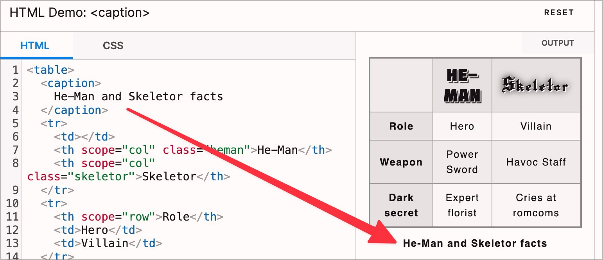

# Prüfpunkt: Tabellenüberschriften

## Beschreibung

Insbesondere komplexe Daten-Tabellen weisen Tabellenüberschriften (`<caption>`) auf.

## Prüfmethode (in Kürze)

**Screenreader:** Tabelle erkunden und prüfen, ob `<caption>`-Element dabei auch ausgegeben wird.

## Prüfmethode für Web (ausführlich)

### Prüf-Schritte

1. Seite öffnen
1. **🏷️-49 Tables (Bookmarklet)** ausführen
1. Sicherstellen, dass (insbesondere ausführliche) Tabellen eine Beschriftung (`<caption>`) haben
    - **🙂 Beispiel:** Eine ausführliche Tabelle hat die Beschriftung "Mitgliedstaaten der UNO"
    - **🙄 Beispiel:** Eine relativ kleine Tabelle hat eine Beschriftung mit `aria-label`
        - ⚠️ Wir ermuntern unsere Kunden, möglichst für alle Nutzenden dasselbe Erlebnis zu bieten: das `aria-label` für Screenreader (anstelle einer visuell sichtbaren `<caption>`) ist gut gemeint, aber auch sehende Nutzer würden ggf. von der Beschriftung profitieren
    - **🙄 Beispiel:** Eine relativ kleine Tabelle hat gar keine Beschriftung
        - ⚠️ Wir ermuntern unsere Kunden, Tabellen generell zu beschriften
    - **😡 Beispiel:** Eine ausführliche Tabelle hat gar keine Beschriftung

### Nachprüfen mit Screenreader

Bei zweifelhaftem Code (z.B. Einsatz von `role="table"`) sollte besser mit **🏷️-13 NVDA Screenreader** nachgeprüft werden:

- Mit `T` zu Tabelle springen

⚠️ Denn: viele Fehler findet man oft auch ohne Screenreader, z.B. wenn die Semantik komplett fehlt oder offensichtlich falsch ist. Wenn Semantik aber grundsätzlich **vorhanden scheint**, lässt sich deren Korrektheit und Sinnhaftigkeit oft nur mit Screenreader final beurteilen.

## Screenshots typischer Fälle

