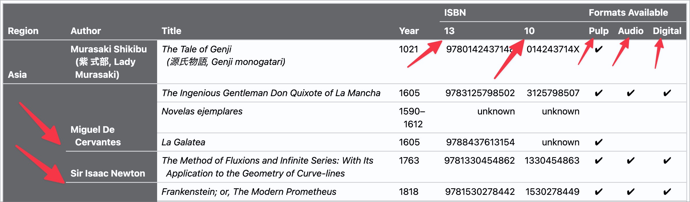

# ✅ Überspannende Zellen

WCAG-Kriterium: [📜 1.3.1d Tabellarische Daten](..)

## Beschreibung

Tabellen, deren Zellen mehrere Spalten und/oder Zeilen überspannen, sind für Screenreader weiterhin gut verständlich.

## Prüfmethode (in Kürze)

**Screenreader:** Durch Tabelle navigieren und prüfen, ob Spalten- und Zeilen-Titel korrekt ausgegeben werden.

## Prüfmethode für Web (ausführlich)

### Prüf-Schritte

1. Seite öffnen
1. **🏷️-13 NVDA Screenreader** ausführen
1. Mit `T` zu Tabelle springen
1. Mit `Ctrl`+`Alt`+`Pfeile` durch die Zellen navigieren (quasi wie in Excel) und sicherstellen, dass jeweils die korrekten Zeilen-Header angesagt werden
    - **🙂 Beispiel:** Bei einer Länder-Tabelle überspannt die Header-Zeile `<th colspan="2">Kontinent</th>` die beiden darunter liegenden Header-Zeilen `<th>Europa</th>` und `<th>Afrika</th>`. Beim Erreichen der Zeile "Schweiz" wird sowohl "Kontinent" wie auch "Europa" angesagt (ausser man bewegte sich davor schon in diesen beiden Spalten); beim Erreichen der Zeile "Kenia" wird sowohl "Kontinent" wie auch "Afrika" angesagt (ausser man bewegte sich davor schon in diesen beiden Spalten).
        - ⚠️ Screenreader geben Zeilen- und Spalten-Header nur aus, wenn man sich in eine solche hinein bewegt! Wenn man in derselben bleibt (z.B. in "Europa"), dann wird sie nicht erneut ausgegeben (z.B. wenn man sich von der Zeile "Deutschland" in die Zeile "Schweiz" bewegt). Bei horizontalem Bewegen werden also nur Spalten-Header angesagt; bei vertikalem Bewegen nur Zeilen-Header. Dies vermeidet redundante Screenreader-Ausgaben.
    - **😡 Beispiel:** Eine Tabelle verwendet derart viele überspannende Zellen, dass der Screenreader beim Navigieren die korrekten Header nicht mehr ausgibt.
        - ⚠️ Obwohl HTML dies seit Jahrzehnten erlaubt, sind Screenreader nach wie vor schnell überfordert mit solchen Tabellen. Ob das Problem eher bei den Browsern oder den Screenreader liegt, ist unklar.

## Screenshots typischer Fälle

