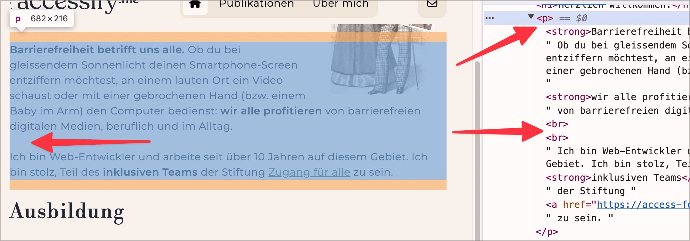
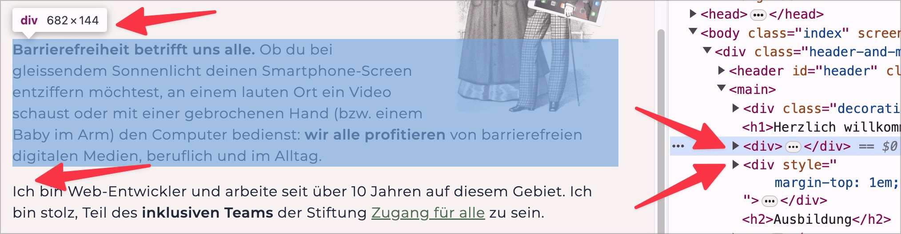

# ✅ Absätze semantisch korrekt

WCAG-Kriterium: [📜 1.3.1e Semantisch richtiges Markup](..)

## Beschreibung

Absätze sind semantisch korrekt ausgezeichnet, nicht nur visuell (z.B. mittels doppelten ` `).

## Prüfmethode (in Kürze)

**Bookmarklet "Inhalte gegliedert":** Ausführen und mit Seite abgleichen: Sind Absätze korrekt ausgezeichnet? Fallen irgendwo ` `-Elemente ungünstig auf?

## Prüfmethode für Web (ausführlich)

### Prüf-Schritte

1. Seite öffnen
1. [🏷️ Inhalte gegliedert Bookmarklet](/de/tags/inhalte-gegliedert-bookmarklet) ausführen (oder mit [🏷️ NVDA Screenreader](/de/tags/nvda-screenreader) direkt mit `P` von Paragraf zu Paragraf springen)
    - ⚠️ Um Probleme genauer zu evaluieren, ist der [🏷️ DOM Inspektor](/de/tags/dom-inspektor) nützlich
1. Sicherstellen, dass Textblöcke korrekt als `
` ausgezeichnet sind
    - **🙂 Beispiel:** Textblöcke auf einer Seite sind jeweils als eigene `
` ausgezeichnet
    - **😡 Beispiel:** Textblöcke sind als `
` (oder ähnlich) ausgezeichnet
    - **😡 Beispiel:** Ein einzelnes `
` umgibt mehrere Textblöcke; dazwischen befinden sich doppelte Zeilenumbrüche (` `), um visuell den Eindruck mehrerer Absätze zu erzeugen

⚠️ Es geht hier insbesondere darum, durch klare Strukturierung die Navigation innerhalb von Fliess-Texten zu erleichtern. Sehr kurze Schriftzüge (wie z.B. der Name eines Autors am Anfang eines Artikels oder ein "Copyright 2024 by ACME Inc." o.ä. im Footer) dürfen durchaus als `
` oder `` ausgezeichnet sein.

## Prüfmethode für Mobile (Ergänzungen zu Web)

Sowohl auf Web-Views als auch native Inhalte 1:1 übertragbar.

## Prüfmethode für PDF (Ergänzungen zu Web)

### Prüf-Schritte
1. PDF mit [🏷️ Adobe Reader](/de/tags/adobe-reader) öffnen
1. Mit [🏷️ NVDA Screenreader](/de/tags/nvda-screenreader) vorlesen lassen
1. Prüfen, dass Absätze korrekt als solche ausgegeben werden.

## Details zum blinden Testen

Ja. Es ist allerdings etwas mühsam, da Paragrafen nicht explizit vom Screenreader angesagt werden. Man kann mittels `P` zu korrekt umgesetzten Paragrafen springen; hingegen nicht korrekt umgesetzte Texte zu finden kann umständlich sein.

## Screenshots typischer Fälle

## Videos

- [🎬 Paragraf aufgeteilt in drei P-Elemente (forcierter Zeilenumbruch) - Atupri (🚨💻)](/de/videos/paragraf-aufgeteilt-in-drei-p-elemente-forcierter-zeilenumbruch-atupri)
