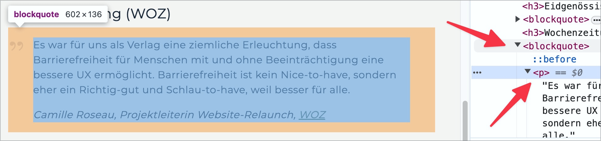

# ✅ Inhalte semantisch korrekt

WCAG-Kriterium: [📜 1.3.1e Semantisch richtiges Markup](..)

## Beschreibung

Inhalte befinden sich innerhalb semantisch bedeutsamer HTML-Elemente (z.B. `<h#>`, `
`, `<ul>`, `<ol>`, etc.); das Verwenden von `
`- oder ``-Elementen (die keine semantische Relevanz aufweisen) ist nicht ausreichend.

## Prüfmethode (in Kürze)

**Bookmarklet "Inhalte gegliedert":** Ausführen und mit Seite abgleichen: Befinden sich Inhalte in semantisch bedeutsamen Containern?

## Prüfmethode für Web (ausführlich)

### Prüf-Schritte

1. Seite öffnen
1. Mit [🏷️ NVDA Screenreader](/de/tags/nvda-screenreader) Inhalte lesen (oder mit [🏷️ DOM Inspektor](/de/tags/dom-inspektor) direkt untersuchen)
1. Sicherstellen, dass unterschiedliche Inhalte korrekt als solche angesagt werden
    - ⚠️ Für viele Inhalts-Typen (z.B. [📜-1.3.1a Überschriften-Struktur](/de/wcag/1.3.1a-ueberschriften-struktur), [📜-1.3.1b Aufzählungen und Listen](/de/wcag/1.3.1b-aufzaehlungen-und-listen), [✅ Absätze semantisch korrekt](/de/wcag/1.3.1e-semantisch-richtiges-markup/absaetze-semantisch-korrekt)) gibt es spezifischere Prüfpunkte! Der vorliegende Prüfpunkt zielt auf weniger oft angetroffene Inhalts-Typen ab; auch dient er dazu, "frei umher schwebende Texte" (in `
`, ``, o.ä.) abzustrafen, welche keine Semantik haben und vom Tester nicht klar einem Inhalts-Typ zugeordnet werden können.
    - **🙂 Beispiel:** Ein Blockzitat ist korrekt als `<blockquote>` ausgezeichnet
        - **😡 Beispiel:** Es ist als `
`, `
` o.ä. ausgezeichnet
    - **🙂 Beispiel:** Eine Adresse ist korrekt als `<address>` ausgezeichnet
        - ⚠️ Zeilenumbrüche in Adressen sind eine der wenigen Situationen, in welchen ` ` angebracht sind!
    - **🙂 Beispiel:** Ein besonders betontes Wort in einem Satz ist mit `<em>` oder `<strong>` formatiert, z.B. `
Wir müssen <strong>jetzt</strong> handeln!
`.
        - **😡 Beispiel:** Das Wort ist als `<i>`, `<b>`, `` o.ä. ausgezeichnet

⚠️ Es geht hier insbesondere darum, durch klare Strukturierung die Navigation innerhalb von Fliess-Texten zu erleichtern. Sehr kurze Schriftzüge (wie z.B. der Name eines Autors am Anfang eines Artikels oder ein "Copyright 2024 by ACME Inc." o.ä. im Footer) dürfen durchaus als `
` oder `` ausgezeichnet sein.

## Prüfmethode für Mobile (Ergänzungen zu Web)

Sowohl auf Web-Views als auch native Inhalte 1:1 übertragbar.

## Prüfmethode für PDF (Ergänzungen zu Web)

### Prüf-Schritte
1. PDF mit [🏷️ Adobe Reader](/de/tags/adobe-reader) öffnen
1. Mit [🏷️ NVDA Screenreader](/de/tags/nvda-screenreader) vorlesen lassen
1. Prüfen, dass Inhalte korrekt ausgegeben werden.

## Details zum blinden Testen

Teilweise: da gewisse Formatierungen nämlich nicht explizit vom Screenreader angesagt werden, weiss man deswegen oft gar nicht, dass da eine bedeutungstragende Formatierung existiert.

## Screenshots typischer Fälle

## Videos

- [🎬 Paragraf aufgeteilt in drei P-Elemente (forcierter Zeilenumbruch) - Atupri](/de/videos/paragraf-aufgeteilt-in-drei-p-elemente-forcierter-zeilenumbruch-atupri)
