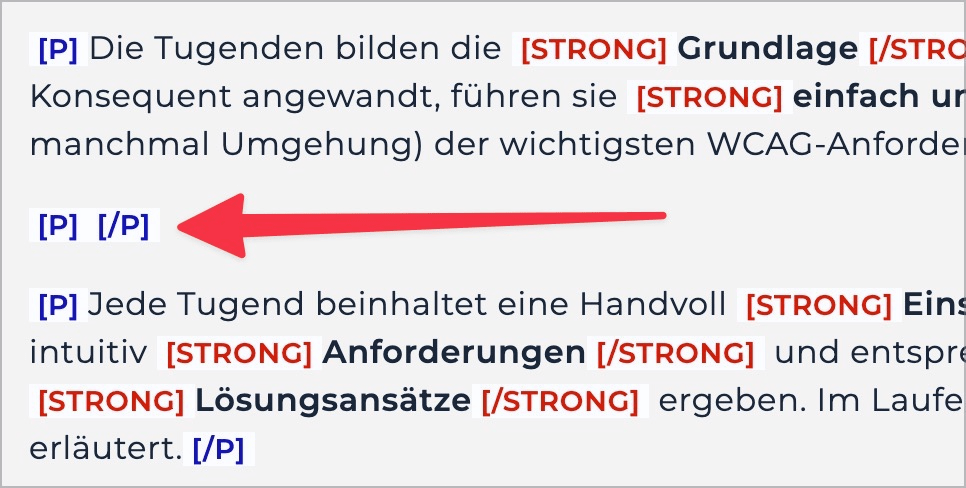

# ✅ Leere Elemente

WCAG-Kriterium: [📜 1.3.1e Semantisch richtiges Markup](..)

## Beschreibung

Leere bedeutungstragende Elemente werden vermieden.

## Prüfmethode (in Kürze)

**Bookmarklet "Inhalte gegliedert":** Ausführen und mit Seite abgleichen: Befinden sich irgendwo leere bedeutungstragende Elemente?

## Prüfmethode für Web (ausführlich)

### Prüf-Schritte

1. Seite öffnen
1. [🏷️ Inhalte gegliedert Bookmarklet](/de/tags/inhalte-gegliedert-bookmarklet) ausführen (oder mit [🏷️ NVDA Screenreader](/de/tags/nvda-screenreader) direkt mit `P` von Paragraf zu Paragraf springen)
    - ⚠️ Um Probleme genauer zu evaluieren, ist der [🏷️ DOM Inspektor](/de/tags/dom-inspektor) nützlich
1. Sicherstellen, dass keine leeren `
` vorhanden sind
    - **🙂 Beispiel:** Es sind keine leeren `
` vorhanden
    - **😡 Beispiel:** Es sind leere `
` vorhanden (z.B. um Abstand zwischen zwei Textblöcken zu generieren, oder einfach weil sie "vergessen" wurden)

⚠️ Es geht hier spezifisch um Paragrafen! Screenreader kündigen andere Elemente manchmal auch als "leer" an.

## Prüfmethode für Mobile (Ergänzungen zu Web)

Sowohl auf Web-Views als auch native Inhalte 1:1 übertragbar.

## Prüfmethode für PDF (Ergänzungen zu Web)

### Prüf-Schritte
1. PDF mit [🏷️ Adobe Reader](/de/tags/adobe-reader) öffnen
1. Mit [🏷️ NVDA Screenreader](/de/tags/nvda-screenreader) vorlesen lassen
1. Prüfen, dass keine leeren Absätze ausgegeben werden.

## Details zum blinden Testen

Ja: man kann mittels `P` von Paragraf zu Paragraf springen. Wenn diese als "leer" angesagt werden, ist allerdings nicht immer 100% klar, ob sie tatsächlich überhaupt keinen Inhalt haben, oder ob ihr Inhalt einfach nicht von Screenreadern ausgelesen werden kann (etwa ein Bild mit leerem Alt-Text).

## Screenshots typischer Fälle

