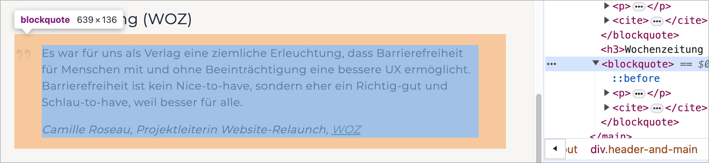

# ✅ Zitate semantisch korrekt

WCAG-Kriterium: [📜 1.3.1e Semantisch richtiges Markup](..)

## Beschreibung

Visuell erkennbare Zitate sind semantisch korrekt ausgezeichnet (z.B. als `<blockquote>` und `<cite>`), sodass der jeweilige Text auch beim Einsatz von assistierenden Technologien als Zitat erkannt wird.

## Prüfmethode (in Kürze)

**Bookmarklet "Inhalte gegliedert":** Ausführen und mit Seite abgleichen: Sind Zitate als solche ausgezeichnet?

## Prüfmethode für Web (ausführlich)

### Prüf-Schritte

1. Seite öffnen
1. [🏷️ Inhalte gegliedert Bookmarklet](/de/tags/inhalte-gegliedert-bookmarklet) ausführen (oder mit [🏷️ NVDA Screenreader](/de/tags/nvda-screenreader) direkt mit `Q` von Zitat zu Zitat springen)
    - ⚠️ Um Probleme genauer zu evaluieren, ist der [🏷️ DOM Inspektor](/de/tags/dom-inspektor) nützlich
1. Sicherstellen, dass Zitate korrekt als `<blockquote>` ausgezeichnet sind
    - **🙂 Beispiel:** Kennedy's Zitat "Ich bin ein Berliner!" ist als `<blockquote>` ausgezeichnet
        - ⚠️ Es dürfen weitere Elemente wie `
`, `<ul>`, etc. enthalten sein
        - **😡 Beispiel:** Es ist als `
` o.ä. umgesetzt

⚠️ Es geht hier insbesondere um Blockzitate, welche auch visuell klar als solche erkennbar sind! Kurze Zitate, welche innerhalb eines Fliesstexts stehen, können als `<q>` umgesetzt werden.

## Screenshots typischer Fälle

