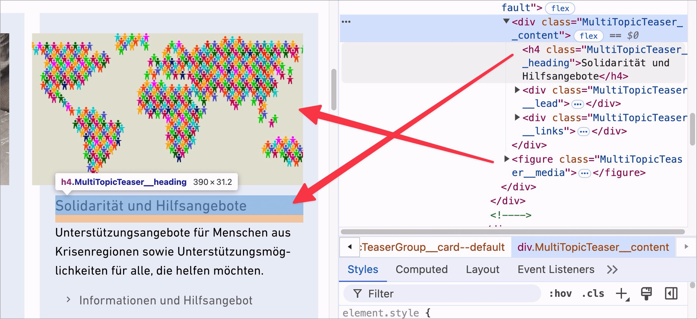
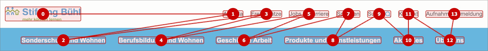
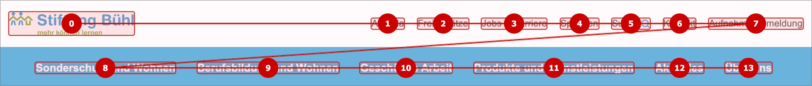

# ✅ Korrekte Reihenfolge

WCAG-Kriterium: [📜 1.3.2 Bedeutungsvolle Reihenfolge - A](..)

## Beschreibung

Inhalte müssen im Code (DOM) eine korrekte Reihenfolge aufweisen (unabhängig von CSS).

## Prüfmethode (in Kürze)

**Screenreader:** Inhalte erkunden und prüfen, ob sie in der erwarteten Reihenfolge ausgegeben werden.

## Prüfmethode für Web (ausführlich)

### Test-Schritte

1. Seite öffnen
1. Mit [🏷️ NVDA Screenreader](/de/tags/nvda-screenreader) durch die Seite navigieren
    - Auch der [🏷️ DOM Inspektor](/de/tags/dom-inspektor) kann aufschlussreiche Informationen liefern
1. Sicherstellen, dass die Inhalte sinnvoll angeordnet sind:
    - Befinden sich Überschriften im DOM stets vor den zugehörigen Inhalten?
        - **🙂 Beispiel:** Ein News-Teaser startet visuell mit einer Überschrift, dann kommen weitere Inhalte wie z.B. ein Bild, Paragrafen, "Mehr lesen"-Link, etc. Die Reihenfolge im DOM ist entsprechend.
        - **🙂 Beispiel:** Ein News-Teaser startet visuell **nicht** mit einer Überschrift, sondern zuerst kommt z.B. ein Bild oder ein Text (Datum, Autor, Kategorie...), und dann erst die Überschrift plus weitere Inhalte. Im DOM allerdings kommt zuerst die Überschrift und dann erst die anderen Inhalte.
            - **😡 Beispiel:** Im DOM kommt zuerst das Bild (bzw. Text), und dann erst die Überschrift.
    - Sind Inhalte korrekt aneinander gereiht?
        - **🙂 Beispiel:** Eine Webseite zeigt zwei Text-Spalten an, wobei jede Spalte mit einer eigenen Überschrift beginnt. Im DOM kommt zuerst die Überschrift der ersten Spalte, dann deren Paragrafen; dann die Überschrift der zweiten Spalte, dann deren Paragrafen.
            - **😡 Beispiel:** Im DOM kommt zuerst die Überschrift der ersten Spalte, dann die Überschrift der zweiten; dann die Paragrafen der ersten Spalte, dann die Paragrafen der zweiten.
    - Ist das letzte Element eines Formulars stets der "Abschicken"-Schalter (oder ein ähnlicher, z.B. auch "Abbrechen" oder "Zurücksetzen")?
        - **🙂 Beispiel:** Ein Kontakt-Formular hat als visuell letztes Element einen "Nachricht senden"-Schalter. Die Reihenfolge im DOM ist entsprechend.
        - **🙄 Beispiel:** Ein Bestell-Formular hat visuell unter dem "Bestellen!"-Schalter noch eine Checkbox "Durch Abschicken dieses Formulars akzeptiere die AGBs". Im DOM allerdings kommt zuerst die Checkbox und dann erst der Schalter.
            - ⚠️ Auch wenn die DOM-Reihenfolge hier korrekt ist und sowohl Tastatur- als auch Screenreader-Nutzende deshalb die Checkbox finden, kann es passieren, dass Maus-Nutzende die Checkbox nicht finden (wenn sie nicht weit genug scrollen). Entsprechend empfehlen wir generell, dass auch visuell der Schalter stets das letzte Element sein soll.
            - **😡 Beispiel:** Im DOM kommt zuerst der Schalter, dann erst die Checkbox.

⚠️ Die genannten Beispiele werden beim Testen häufig angetroffen. Die aufgezeigten Probleme können aber auf jegliche weitere Arten von Inhalten erweitert werden. So können zwei Inhalte visuell zwar sinnvoll zueinander in Beziehung stehen, in ihrer Reihenfolge im DOM aber zu Verwirrung führen (siehe obiges Beispiel mit den zwei Text-Spalten). CSS ist sehr mächtig und es kann damit entsprechend auch (gewollt oder ungewollt) viel Unsinn angestellt werden. Es ist also unerlässlich, auch "vernünftig aussehende" Inhalts-Layouts mit Screenreadern zu testen.

## Prüfmethode für Mobile (Ergänzungen zu Web)

Kann sowohl in nativen / hybriden Mobile Apps vorkommen, wie auch auf Mobile Webseiten.

## Prüfmethode für PDF (Ergänzungen zu Web)

### Prüf-Schritte
1. PDF mit [🏷️ Adobe Reader](/de/tags/adobe-reader) öffnen
1. Mit [🏷️ NVDA Screenreader](/de/tags/nvda-screenreader) vorlesen lassen
1. Prüfen, dass die Reihenfolge sinnvoll ist.

## Details zum blinden Testen

Generell ja. Gerade bei Überschriften ist es aber aus dem Kontext nicht immer schlüssig beurteilbar, ob ein Problem vorliegt.

## Screenshots typischer Fälle

## Videos

Keine Videos verfügbar.
