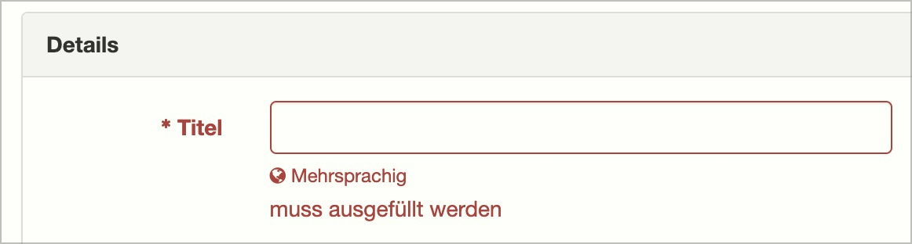

# ✅ Sensorische Hinweise

## Beschreibung

Inhalte weisen nicht ausschliesslich auf sensorische Eigenschaften (rein visuell erkennbar, rein akustisch verständlich) hin, z.B. "Den grünen Schalter links betätigen", "Korrigieren Sie die Eingaben in den rot umrandeten Feldern", "Mit Klick auf das Bild rechts…".

## Prüfmethode (in Kürze)

**Manuelle Prüfung:** Inhalte durchlesen und auf Nennung sensorischer Eigenschaften achten.

## Prüfmethode für Web (ausführlich)

### Prüf-Schritte

1. Seite öffnen
1. Inhalte genau lesen und ggf. mit Funktionalitäten interagieren, sowie auf auditive Signale achten
1. Sicherstellen, dass keine Anweisungen vorhanden sind, die sich auf eine einzelne sensorische Wahrnehmungsfähigkeit beschränken
    - **🙂 Beispiel:** Ein fehlerhaftes Eingabefeld wird rot umrandet und mit einem Ausrufezeichen-Symbol dargestellt; oberhalb des Formulars steht die Anweisung "Korrigieren Sie die rot umrandeten und mit Ausrufezeichen gekennzeichneten Felder!"
        - ⚠️ Natürlich müssen solche Felder auch für Screenreader als fehlerhaft erfahrbar sein! Diesbezüglich existieren **✅-93 Fehlermeldungen in Formularen** und **✅-94 Pflichtfelder**.
        - **😡 Beispiel:** Die Anweisung lautet "Korrigieren Sie die rot umrandeten Felder!"
    - **🙂 Beispiel:** Eine Hilfeseite schreibt: "Wählen Sie rechts in der Seiten-Navigation einen Eintrag", wobei diese Navigation z.B. durch eine entsprechende Überschrift klar als "Seiten-Navigation" betitelt wird
        - **🙄 Beispiel:** Die Hilfeseite schreibt: "Wählen Sie rechts einen Navigations-Eintrag" → hier kann man sich streiten, ob diese nicht ganz exakte Betitelung ausreicht oder nicht
        - **😡 Beispiel:** Die Hilfeseite schreibt: "Wählen Sie rechts einen Eintrag" → keinerlei Hinweis auf den Titel des Bereichs
    - **🙂 Beispiel:** Eine Anweisung lautet "Klicken Sie auf das viereckige Speichern-Symbol"
        - **😡 Beispiel:** Sie lautet "Klicken Sie auf das viereckige Symbol"
    - **🙂 Beispiel:** Eine fehlerhafte Eingabe resultiert in einem auditiven Signal, färbt das Feld rot und zeigt ein Ausrufezeichen-Symbol an
        - **🙄 Beispiel:** Sie resultiert in einem auditiven Signal und färbt das Feld rot
            - ⚠️ Hier muss man sich fragen, ob dies ausreicht: die Anforderung, dass mehr als eine Wahrnehmungs-Modalität bedient werden soll, ist erfüllt - aber für Screenreader-Nutzer wird ggf. dennoch nicht ausreichend klar, was das auditive Signal bedeuten soll.
        - **😡 Beispiel:** Es wird nur ein auditives Signal erzeugt
    - **🙂 Beispiel:** Eine Grafik hat den Alternativtext "Statistik über die Geburtenrate, Details nachfolgend", wobei nach der Grafik ein Paragraf mit Details folgt
        - **😡 Beispiel:** Der Alternativtext ist "Statistik über die Geburtenrate, Details rechts"

## Screenshots typischer Fälle

