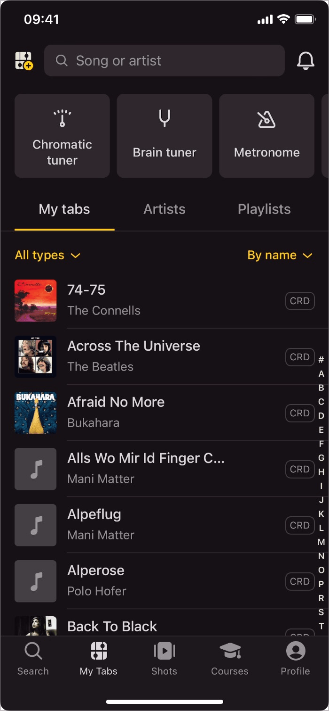
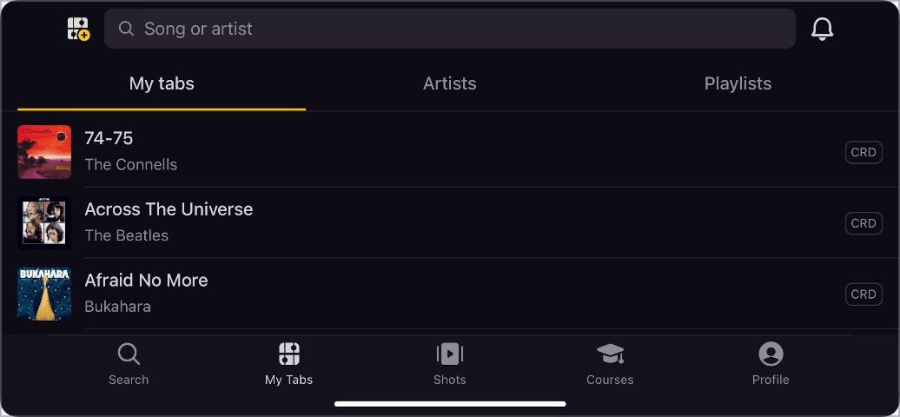
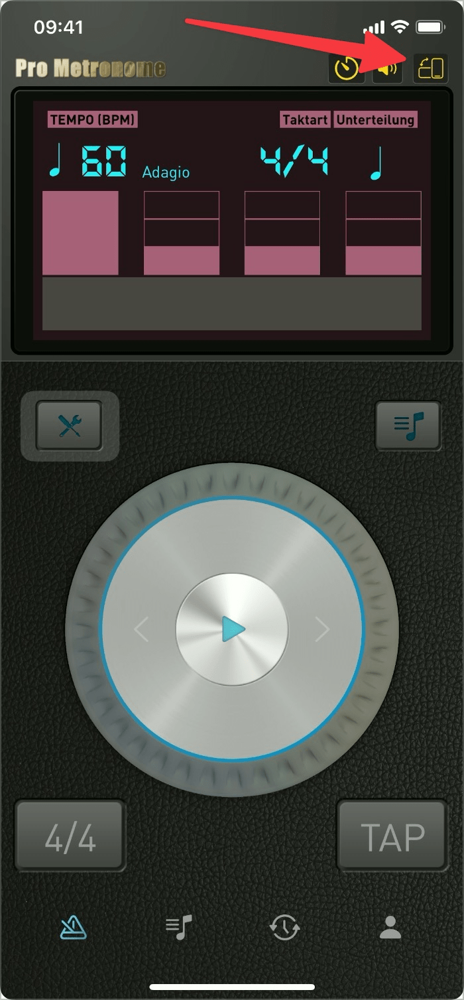

# ✅ Hoch- und Querformat

## Beschreibung

Inhalte sind in beiden Bildschirmorientierungen (Hoch- und Querformat) korrekt dargestellt und nutzbar. Passt sich der Inhalt nicht automatisch an die Bildschirmorientierung an, steht ein Schalter zur Verfügung zum manuellen Drehen des Bildschirminhalts (für Websites vom Browser sichergestellt, für Mobile Apps durch Design und Entwicklung sicherzustellen).

## Prüfmethode (in Kürze)

**Manuelle Prüfung:** Statt ein echtes mobiles Gerät zu verwenden, können diverse Browser das Rotieren der Ausrichtung auch simulieren, in etwa Firefox: Responsive Design Mode > Rotate View Port.

## Prüfmethode für Web (ausführlich)

### Test-Schritte

Desktop-Computer haben stets nur eine Ausrichtung (egal ob der Bildschirm Hoch- oder Querformat hat).

⚠️ Dies ist eine der sehr seltenen WCAG-Kriterien, welche sich hauptsächlich auf Mobile-Anwendung beziehen.

## Screenshots typischer Fälle

