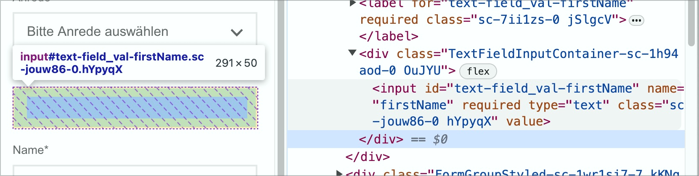

# ✅ Automatisches Ausfüllen

WCAG-Kriterium: [📜 1.3.5 Eingabezweck bestimmen - AA](..)

## Beschreibung

Eingabefelder zu Nutzerdaten können automatisch ausgefüllt werden.

## Prüfmethode (in Kürze)

**Web Developer Toolbar:** Forms > Display Form Details: Werte des `autocomplete`-Attributs mit Eingabefeldern vergleichen.

## Prüfmethode für Web (ausführlich)

### Prüf-Schritte

1. Seite öffnen
1. Formulare für persönliche Daten mit [🏷️ DOM Inspektor](/de/tags/dom-inspektor) untersuchen
1. Sicherstellen, dass alle Eingabefelder ein sinnvolles und korrektes `autocomplete`-Attribut haben
    - ⚠️ Die Liste an möglichen Werten findet sich hier: <https://www.w3.org/TR/WCAG22/#input-purposes>
    - **🙂 Beispiel:** Das Eingabefeld für den Vornamen hat `autocomplete="given-name"`
        - **😡 Beispiel:** Es hat `autocomplete="first-name"` → diesen Wert gibt es nicht!
        - **😡 Beispiel:** Es hat `autocomplete="family-name"` → falscher Wert!
        - **😡 Beispiel:** Es hat kein `autocomplete`-Attribut

## Prüfmethode für Mobile (Ergänzungen zu Web)

Auf Web-Views 1:1 übertragbar.

Für native Apps hingegen obsolet.

## Prüfmethode für PDF (Ergänzungen zu Web)

Auf PDF nicht anwendbar.

## Details zum blinden Testen

Mit entsprechenden Tools, welche Adressen speichern und automatisch einfügen können, kann dieses Verhalten auch blind getestet werden (vorausgesetzt, diese Tools sind selber barrierefrei).

## Screenshots typischer Fälle

