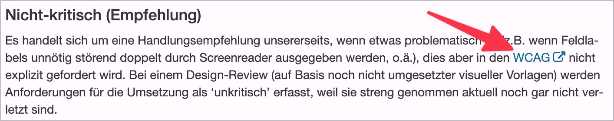

# ✅ Links in Fliesstext

WCAG-Kriterium: [📜 1.4.1 Benutzung von Farbe - A](..)

## Beschreibung

Wenn Links innerhalb von Fliesstext nur durch Farbe vom Fliesstext unterschieden werden, muss der Kontrast zwischen Link und umgebendem Fliesstext den minimalen Kontrastwert von `3:1` erreichen. Als Alternative kann eine weitere visuelle Auszeichnung von Links verwendet werden (z.B. Unterstreichung, Fettschrift, Rahmen, etc.).

## Prüfmethode (in Kürze)

**Manuelle Prüfung:** Inhalte durchsehen und auf rein farblich vermittelte Links achten. Kontrastermittlung ggf. durch Colour Contrast Analyser.

## Prüfmethode für Web (ausführlich)

### Prüf-Schritte

1. Seite öffnen
1. Fliesstexte sichten und nach enthaltenen Links Ausschau halten
1. Sicherstellen, dass die Links gut erkennbar sind (durch Mindestkontrast von `3:1` oder zusätzliches visuelles Attribut wie Unterstreichung):
    - **🙂 Beispiel:** Ein Fliesstext mit schwarzer Schrift beinhaltet einen Link mit roter Schrift (Kontrast mind. `3:1`); der Link hat keine zusätzlichen visuellen Attribute (wie Unterstreichung o.ä.)
        - ⚠️ Auch wenn dies laut WCAG ausreichend ist, ist es grundsätzlich empfehlenswert, Links in Fliesstext nicht nur farblich hervorzuheben, sondern stets z.B. zu unterstreichen
    - **🙂 Beispiel:** Ein Fliesstext mit schwarzer Schrift beinhaltet einen Link mit dunkelgrauer Schrift (Kontrast kleiner als `3:1`); der Link ist zusätzlich durch Unterstreichung erkennbar
        - **🙄 Beispiel:** Der Link ist nicht durch Unterstreichung, sondern durch ein Symbol erkennbar
            - ⚠️ Dies kann ausreichend sein, allerdings gibt ein solches Symbol keinen Hinweis darauf, wie gross der klickbare Bereich ist (also wieviele Wörter des Fliesstexts zum Link gehören)
        - **😡 Beispiel:** Der Link ist weder durch Unterstreichung, noch über ein Symbol o.ä. erkennbar

## Prüfmethode für Mobile (Ergänzungen zu Web)

Sowohl auf Web-Views als auch native Inhalte 1:1 übertragbar.

## Prüfmethode für PDF (Ergänzungen zu Web)

Prüf-Schritte analog zu Web-Inhalten.

## Details zum blinden Testen

Kaum testbar (auch wenn gewisse Formatierungen wie Unterstreichung über `Insert`+`F` ausgegeben werden können).

## Screenshots typischer Fälle

## Videos

Keine Videos verfügbar.
