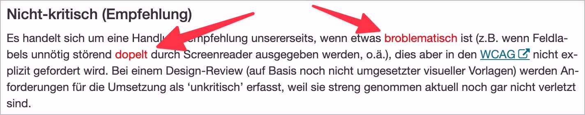
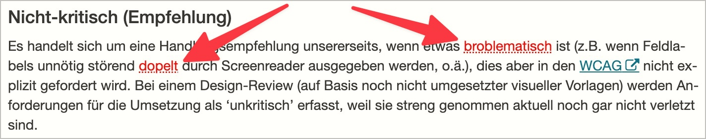
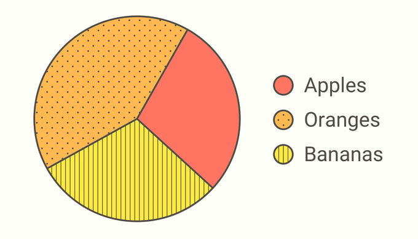

# ✅ Nicht Farbe allein

WCAG-Kriterium: [📜 1.4.1 Benutzung von Farbe - A](..)

## Beschreibung

Information wird nicht durch Farbe allein vermittelt. Das gilt auch für Hover- und Fokus-Zustände. Wenn Information farblich übermittelt wird (z.B. rot hervorgehobene Teile eines Texts, um deren Wichtigkeit zu markieren), ist ein weiterer visueller Reiz vorhanden, um diese Information zu vermitteln (z.B. Fettschrift oder Unterstreichung, unterschiedliche Symbole, zusätzlicher Text).

## Prüfmethode (in Kürze)

**Manuelle Prüfung:** Inhalte durchsehen und auf rein farblich vermittelte Information achten. Kontrastermittlung ggf. durch Colour Contrast Analyser.

## Prüfmethode für Web (ausführlich)

### Prüf-Schritte

1. Seite öffnen
1. Sicherstellen, dass Information nicht durch Farbe alleine vermittelt wird:
    - **🙂 Beispiel:** In einer Navigation wird der aktive Navigations-Punkt durch einen vorangestellten Punkt, Unterstreichung, Fettsetzung o.ä. klar hervorgehoben
        - **🙂 Beispiel:** Er wird nur farblich hervorgehoben; der Kontrast zwischen aktiven und nicht aktiven Elementen beträgt mind. `3:1`
            - **😡 Beispiel:** Der Kontrast beträgt weniger als `3:1`
    - **🙂 Beispiel:** Das aktuell fokussierte Element in einer Navigation wird durch zusätzliche Umrandung o.ä. klar hervorgehoben
        - **🙂 Beispiel:** Es wird nur farblich hervorgehoben; der Kontrast zwischen aktiven und nicht aktiven Elementen beträgt mind. `3:1`
            - **😡 Beispiel:** Der Kontrast beträgt weniger als `3:1`
    - **🙂 Beispiel:** Kuchenstücke in einem Diagramm können nicht nur durch Farbe, sondern auch durch ein Hintergrund-Muster o.ä. klar mit der zugehörigen Legende verknüpft werden
        - **😡 Beispiel:** Die Kuchenstücke sind nur farblich codiert
            - ⚠️ Es gibt natürlich weitere Möglichkeiten, die Legende mit den Kuchenstücken zu verknüpfen, z.B. indem man jedes Kuchenstück einzeln beschriftet, oder indem man Linien vom Kuchenstück zum Eintrag in der Legende zieht, o.ä.

## Screenshots typischer Fälle

