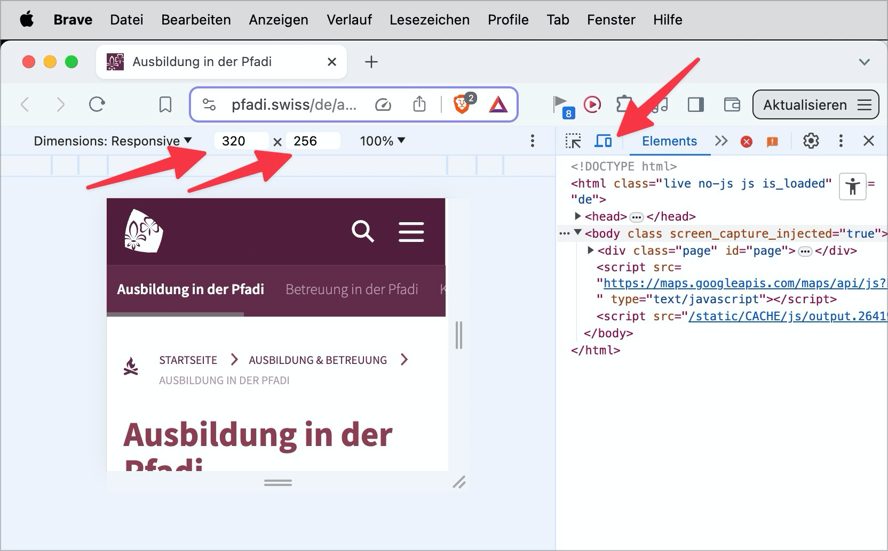
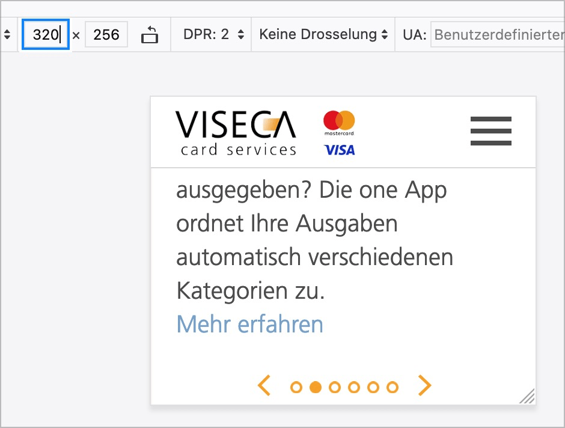
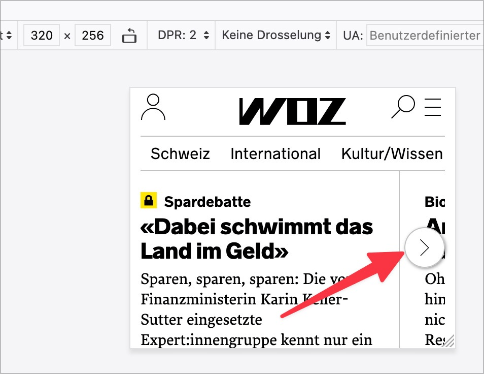

# ✅ Viewport-Mindestdimensionen

WCAG-Kriterium: [📜 1.4.10 Automatischer Umbruch (Reflow) - AA](..)

## Beschreibung

Inhalt lässt sich ohne Einschränkungen (z.B. Überlappungen) und ohne horizontales Scrollen in den Viewport-Mindestdimensionen von `320x256` CSS-Pixel darstellen. Das entspricht einer Vergrösserung auf 400%.

## Prüfmethode (in Kürze)

**Browser:** Zoom schrittweise auf 400% erhöhen und darauf achten, dass keine Darstellungsprobleme auftreten (z.B. Überlappungen), sowie dass höchstens in eine Richtung gescrollt werden muss.

## Prüfmethode für Web (ausführlich)

### Prüf-Schritte

1. Seite öffnen
1. In der [🏷️ Web Developer Extension](/de/tags/web-developer-extension) auf `Resize` → `Resize Window...` klicken und `256`x`320` einstellen (alternativ im [🏷️ DOM Inspektor](/de/tags/dom-inspektor) über die `Geräte Toolbar` möglich)
1. Sicherstellen, dass alle Inhalte weiterhin gut lesbar sind
    - **🙂 Beispiel:** Alle Inhalte sind weiterhin gut lesbar (ohne horizontales Scrollen)
    - **😡 Beispiel:** Es kommt zu unerlaubtem horizontalen Scrollen, z.B. weil Wörter sehr lange sind oder weil fixe Breiten eingestellt sind
        - ⚠️ Lange Wörter treten insbesondere in der Deutschen Sprache auf. Sie können mittels CSS (`hyphens: auto;`) zwar automatisch getrennt werden, aber dies bewirkt nicht immer den gewünschten Effekt. Deshalb wird auch gerne auf JavaScript-Libraries zurück gegriffen, welche Worttrennung im Code "künstlich" forcieren, was aber wiederum unschöne Effekte z.B. auf Screenreader haben kann.
    - **🙂 Beispiel:** Auf einer Seite befindet sich eine breite Tabelle; diese muss (und darf) horizontal gescrollt werden
        - **🙂 Beispiel:** Oder ein Bild, Diagramm, Video...

⚠️ Es gibt mittlerweile Methoden, Tabellen responsiv zu machen, so dass kein horizontales Scrollen mehr notwendig ist. Dies wird von den WCAG aber nicht gefordert. Zudem sind diese Möglichkeiten relativ begrenzt und funktionieren nur bei nicht allzu grossen Tabellen.

## Prüfmethode für Mobile (Ergänzungen zu Web)

Auf Web-Views 1:1 übertragbar.

Für native Apps obsolet.

## Prüfmethode für PDF (Ergänzungen zu Web)

### Prüf-Schritte
1. PDF mit [🏷️ Adobe Reader](/de/tags/adobe-reader) öffnen
1. Mit [🏷️ NVDA Screenreader](/de/tags/nvda-screenreader) vorlesen lassen und/oder
1. Mit Ansicht > Vergrössern > Umfluss Textumfluss aktivieren.
1. Prüfen, dass Inhalte korrekt angezeigt werden.
1. Inhalte, die nicht korrekt umfliessen müssen: Tabellen, Formularfelder, Kopf- und Fusszeilen und Bilder.

## Details zum blinden Testen

Nein.

## Screenshots typischer Fälle

## Videos

Keine Videos verfügbar.
