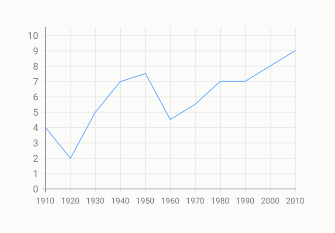

# ✅ Kontrast bei informativen grafischen Elementen

WCAG-Kriterium: [📜 1.4.11 Nicht-Text Kontrast - AA](..)

## Beschreibung

Das Kontrastverhältnis bei informativen grafischen Elementen (z.B. Linien und Kurven in Diagrammen) zu den umgebenden Farben beträgt mindestens `3:1`. Das gilt für alle visuellen Hinweise, die für die Wahrnehmung und Bedienung erforderlich sind.

## Prüfmethode (in Kürze)

**Manuelle Prüfung:** Inhalte durchsehen und auf schwache Kontraste achten. Kontrastermittlung ggf. durch Colour Contrast Analyser.

## Prüfmethode für Web (ausführlich)

### Prüf-Schritte

1. Seite öffnen
1. Sicherstellen, dass Bedeutungs-tragende grafische Elemente genug Kontrast aufweisen
    - **🙂 Beispiel:** Die Kuchenstücke eines Diagramms sind mit kontraststarken (mind. `3:1`) Linien umrandet
        - **😡 Beispiel:** Die Umrandung ist kontrastarm (kleiner als `3:1`)
        - **😡 Beispiel:** Es gibt gar keine Umrandung

## Prüfmethode für Mobile (Ergänzungen zu Web)

Sowohl auf Web-Views als auch native Inhalte 1:1 übertragbar.

## Prüfmethode für PDF (Ergänzungen zu Web)

Prüfschritte analog zu Web-Inhalten.

## Details zum blinden Testen

Nein.

## Screenshots typischer Fälle

### Statistisches Diagramm

### Kuchendiagramm

## Videos

Keine Videos verfügbar.
