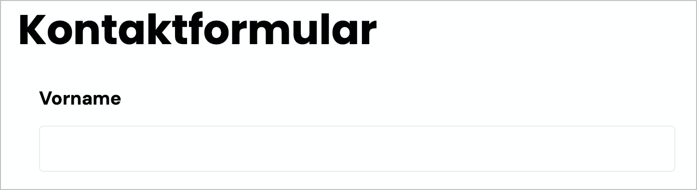
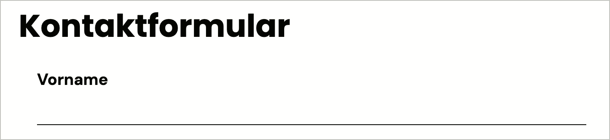
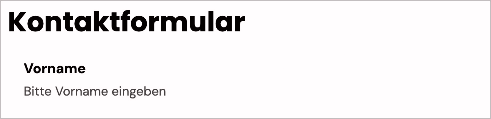
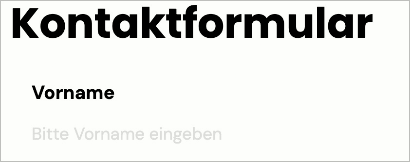
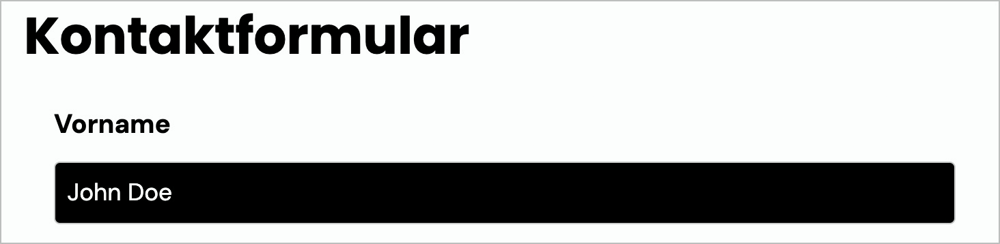
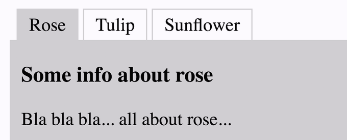
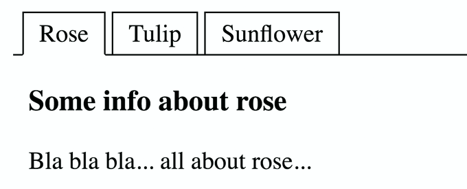
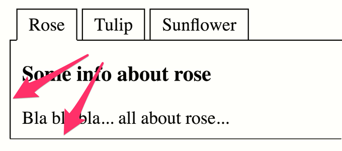

# ✅ Kontrastverhältnis von Bedienelementen

WCAG-Kriterium: [📜 1.4.11 Nicht-Text Kontrast - AA](..)

## Beschreibung

Das Kontrastverhältnis von Bedienelementen (z.B. Textfelder, Radiobuttons, Checkboxen, Schalter, Tabs, etc.) zu den umgebenden Farben beträgt mindestens `3:1`. Das gilt für alle visuellen Hinweise, die für die Wahrnehmung und Bedienung erforderlich sind (z.B. Formularfeldbegrenzungen, Ausklappindikatoren bei Flyouts/Dropdowns, Häkchen in einer Checkbox, etc.), insbesondere auch für die Wahrnehmung des Zustands eines Elements. Der Hover-Zustand eines Elements muss nicht unterscheidbar sein vom Standard-Zustand.

## Prüfmethode (in Kürze)

**Manuelle Prüfung:** Elemente durchsehen, mit ihnen interagieren und auf schwache Kontraste achten. Kontrastermittlung ggf. durch Colour Contrast Analyser.

## Prüfmethode für Web (ausführlich)

### Prüf-Schritte

1. Seite öffnen
1. Sicherstellen, dass Bedeutungs-tragende grafische Eigenschaften interaktiver Elemente genug Kontrast aufweisen
    - **🙂 Beispiel:** Ein Textfeld ist komplett umrandet (`border`); dieser ist kontraststark (mind. `3:1`)
        - **😡 Beispiel:** Die Umrandung ist kontrastarm (kleiner als `3:1`)
        - **🙂 Beispiel:** Das Textfeld ist nur durch eine einzelne Linie (`border-bottom`) als solches erkennbar
        - **🙂 Beispiel:** Das Textfeld hat keine Umrandung, aber der Hintergrund des Textfelds ist farbinvertiert (z.B. komplett Schwarz mit weisser Schrift)
        - **🙄 Beispiel:** Es existiert weder kontrastreiche Umrandung noch Hintergrund; ein kontraststarker Platzhalter-Text gibt aber genügend Hinweis darauf, dass eine Text-Eingabe erforderlich ist (z.B. "Bitte Vorname eingeben")
        - ⚠️ Das gesamte Beispiel kann sinngemäss auf Schalter angewandt werden (statt eines Platzhalter aber natürlich mit einer "normalen" Beschriftung, wie etwa "Nachricht abschicken" o.ä.)!
    - **🙂 Beispiel:** Ein Ausklapp-Element wird dadurch erkennbar, dass ein kleines Dreieck nach unten zeigt; dieses ist kontraststark
        - **😡 Beispiel:** Es ist kontrastarm

## Prüfmethode für Mobile (Ergänzungen zu Web)

Sowohl auf Web-Views als auch native Inhalte 1:1 übertragbar.

## Prüfmethode für PDF (Ergänzungen zu Web)

Prüfschritte analog zu Webinhalten.

## Details zum blinden Testen

Nein.

## Screenshots typischer Fälle

### Textfeld

### Tabliste

## Videos

Keine Videos verfügbar.
