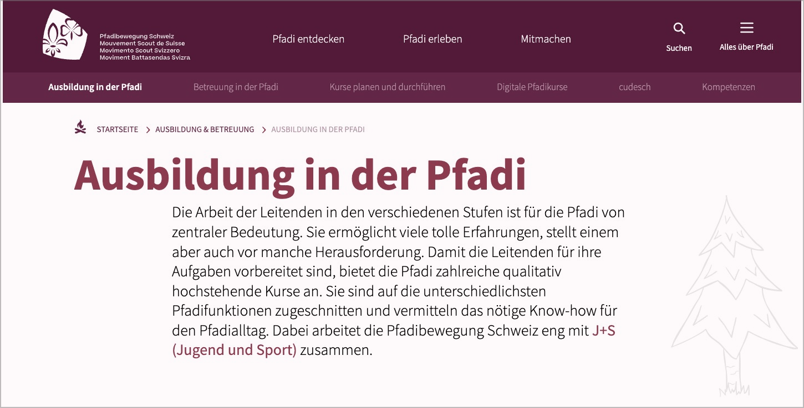
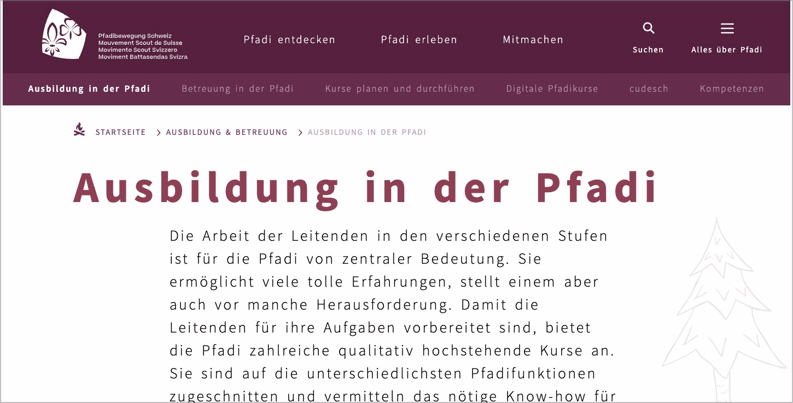

# ✅ Abstände vergrösserbar

WCAG-Kriterium: [📜 1.4.12 Textabstand - AA](..)

## Beschreibung

Abstände zwischen Zeilen, Wörtern und Buchstaben sowie nach Absätzen sind ohne resultierende Einschränkungen um bestimmte Werte vergrösserbar. Ausnahmen sind: Untertitel in Video-Inhalten, PDF-Dokumente.

## Prüfmethode (in Kürze)

**Bookmarklet "Text-Spacing":** Ausführen und auf erwartungsgemässe Anpassung der Inhalte achten.

## Prüfmethode für Web (ausführlich)

### Prüf-Schritte

1. Seite öffnen
1. [🏷️ Text Spacing Bookmarklet](/de/tags/text-spacing-bookmarklet) ausführen
1. Sicherstellen, dass Inhalte weiterhin gut lesbar dargestellt werden
    - **🙂 Beispiel:** Die Inhalte werden weiterhin gut lesbar dargestellt
    - **😡 Beispiel:** Es kommt zu Überlappungen von Text (z.B. aufgrund langer Wörter) oder anderen Elementen
        - ⚠️ Lange Wörter treten insbesondere in der Deutschen Sprache auf. Sie können mittels CSS (`hyphens: auto;`) zwar automatisch getrennt werden, aber dies bewirkt nicht immer den gewünschten Effekt. Deshalb wird auch gerne auf JavaScript-Libraries zurück gegriffen, welche Worttrennung im Code "künstlich" forcieren, was aber wiederum unschöne Effekte z.B. auf Screenreader haben kann.

## Prüfmethode für Mobile (Ergänzungen zu Web)

Auf Web-Views 1:1 übertragbar. Bei nativen Apps gibt es aktuell keine solche Einstellung.

## Prüfmethode für PDF (Ergänzungen zu Web)

Für PDF nicht anwendbar (WCAG-Wortlaut: "Currently, this SC does not apply to PDF as it is not implemented using markup.")

## Details zum blinden Testen

Nein.

## Screenshots typischer Fälle

## Videos

Keine Videos verfügbar.
