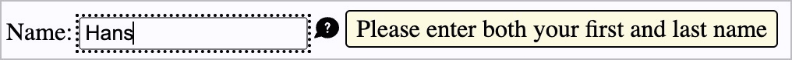
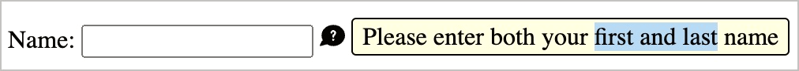
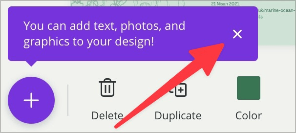
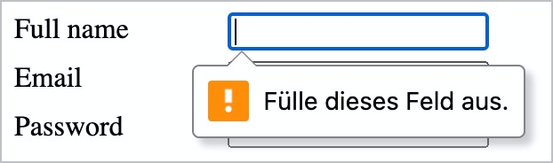

# ✅ Inhalte per Hover oder Fokus

WCAG-Kriterium: [📜 1.4.13 Eingeblendeter Inhalt bei Darüberschweben (Hover) oder Fokus - AA](..)

## Beschreibung

Inhalte, die per Hover oder Fokus eingeblendet werden, sind nicht störend und es kann mit ihnen interagiert werden. Folgende drei Bedingungen sind erfüllt: Per Hover oder Fokus eingeblendete Inhalte sind ausblendbar, hoverbar und dauerhaft (persistent).

## Prüfmethode (in Kürze)

**Manuelle Prüfung:** Elemente durchsehen, mit ihnen interagieren und darauf achten, dass sie sich erwartungsgemäss verhalten: Können Inhalte ein-/ausgeblendet werden? Können per Hover eingeblendete Inhalte selbst auch gehovert werden? Bleiben dauerhaft Inhalte angezeigt?

## Prüfmethode für Web (ausführlich)

### Test-Schritte

1. Seite öffnen
1. Mit Inhalten interagieren (Tastatur und Maus)
1. Sicherstellen, dass eingeblendete Inhalte sich wie erwartet verhalten:
    - Können eingeblendete Inhalte ausgeblendet werden?
        - **🙂 Beispiel:** Ein per Hover eingeblendeter Tooltip verschwindet wieder, wenn man die Maus weg bewegt vom ursprünglichen Element
            - **🙄 Beispiel:** Der Tooltip verschwindet nicht mehr, kann aber durch einen "X"-Schalter ausgeblendet werden
            - **😡 Beispiel:** Der Tooltip verschwindet nicht mehr (und verdeckt andere Inhalte)
        - **🙂 Beispiel:** Ein per Fokus eingeblendeter Tooltip verschwindet wieder, wenn man den Fokus weiter bewegt
            - **🙄 Beispiel:** Der Tooltip verschwindet nicht mehr, kann aber (bei Fokus) durch Drücken von `Esc` ausgeblendet werden
            - **😡 Beispiel:** Der Tooltip verschwindet nicht mehr (und verdeckt andere Inhalte)
        - **🙄 Beispiel:** Ein per Fokus geöffnetes Unter-Menü (z.B. in einer Navigation) kann mit `Esc` wieder geschlossen werden. → ⚠️ Wir empfehlen, solche Elemente nicht automatisch zu öffnen (sondern nur manuell per Klicken)!
            - **😡 Beispiel:** Das Unter-Menü lässt sich nicht schliessen. Dies führt dazu, dass man durch alle Elemente hindurch tabben muss (was insbesondere bei umfassenden, verschachtelten Navigationen extrem mühsam ist); vgl. auch [📜-2.4.1 Blöcke überspringen](/de/wcag/2.4.1-bloecke-ueberspringen)!
    - Können eingeblendete Inhalte gehovert werden?
        - **🙂 Beispiel:** Mit der Maus kann problemlos über einen offenen Tooltip gefahren werden (und dabei z.B. Text markiert werden, um ihn per Copy&Paste weiter zu verwenden)
            - **🙄 Beispiel:** Manchmal klappt es, mit der Maus über den Tooltip fahren zu fahren; manchmal aber auch nicht, weil der Tooltip sich plötzlich schliesst. Dies hängt meistens damit zusammen, dass der Tooltip nicht solide genug programmiert ist (man z.B. einem sehr genauen Pfad mit der Maus folgen muss, um den Bereich nicht versehentlich zu verlassen, welcher das Anzeigen triggert; oder man die Maus sehr schnell bewegen muss, um gewisse Timeouts zum Anzeigen bzw. Ausblenden nicht versehentlich zu überschreiten).
            - **😡 Beispiel:** Es ist unmöglich, die Maus über den offenen Tooltip zu bewegen (oder der Tooltip verschwindet dennoch)
    - Sind eingeblendete Inhalte dauerhaft (persistent)?
        - **🙂 Beispiel:** Ein von der Webseite plötzlich angezeigter Hinweis "Das letzte Ticket für den Event wurde soeben verkauft" bleibt dauerhaft angezeigt (z.B. bis der Nutzer diesen mit einem Klick auf "Schliessen" manuell ausblendet oder die Seite neu lädt)
            - **😡 Beispiel:** Die Meldung wird nach kurzer Zeit automatisch wieder ausgeblendet.
        - **🙂 Beispiel:** Auf einer Auktions-Plattform erscheint die Meldung "Diese Auktion wird in weniger als 1 Minute beendet"; kurz darauf wird die Meldung wieder ausgeblendet.
            - ⚠️ Da diese Meldung essenziell ist für die Funktionsweise der Plattform (die Auktion ist nach einer Minute tatsächlich beendet, weshalb die angezeigte Meldung daraufhin ihre Gültigkeit verliert), ist das automatische Ausblenden in Ordnung.

## Prüfmethode für Mobile (Ergänzungen zu Web)

Kann sowohl in nativen / hybriden Mobile Apps vorkommen, wie auch auf Mobile Webseiten.

## Prüfmethode für PDF (Ergänzungen zu Web)

Für PDF nicht relevant.

## Details zum blinden Testen

Grösstenteils nur sehr eingeschränkt testbar.

## Screenshots typischer Fälle

