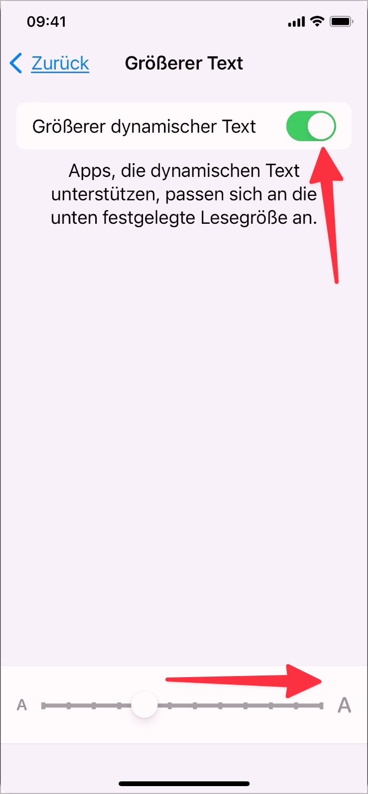

# Prüfpunkt: 200% Zoom

## Beschreibung

Elemente sind auf mindestens 200% zoombar, entweder der Text allein oder die komplette Seite (für Websites in der Regel vom Browser sichergestellt, für Mobile Apps durch Design und Entwicklung sicherzustellen).

## Prüfmethode (in Kürze)

**Browser:** Zoom schrittweise auf 200% erhöhen und auf erwartungsgemässe Anpassung der Inhalte achten.

## Prüfmethode für Web (ausführlich)

### Prüf-Schritte

1. Seite öffnen
1. Zoom-Funktion des Browsers auf 200% setzen
    - Chrome: Mehrmals `Anzeigen` → `Vergrössern` wählen
    - Firefox: Mehrmals `Ansicht` → `Zoom` → `Vergrössern` wählen (die Option `Nur Text zoomen` muss inaktiv sein)
1. Sicherstellen, dass alle Inhalte weiterhin gut lesbar (dass es z.B. nicht zu Überlappungen o.ä. der Inhalte kommt)

⚠️ Früher war es im Internet Explorer nicht möglich, Webseiten als Ganzes zu zoomen. Stattdessen wurden nur Textelemente gezoomt (sozusagen die Schriftgrösse verändert), wobei es zu unschönen Überlappungen von Inhalten kommen konnte; manchmal war das Zoomen auch komplett unmöglich (falls Schriftgrössen mittels `px` festgelegt waren statt mit `em`). Heute wird standardmässig stets die ganze Webseite gezoomt, weshalb vorliegendes Erfolgskriterium kaum mehr verletzt wird. Oft wird anstelle der Desktop-Version einfach irgendwann die Mobile-Version angezeigt, was zu keinen Problemen führen sollte.

## Screenshots typischer Fälle

